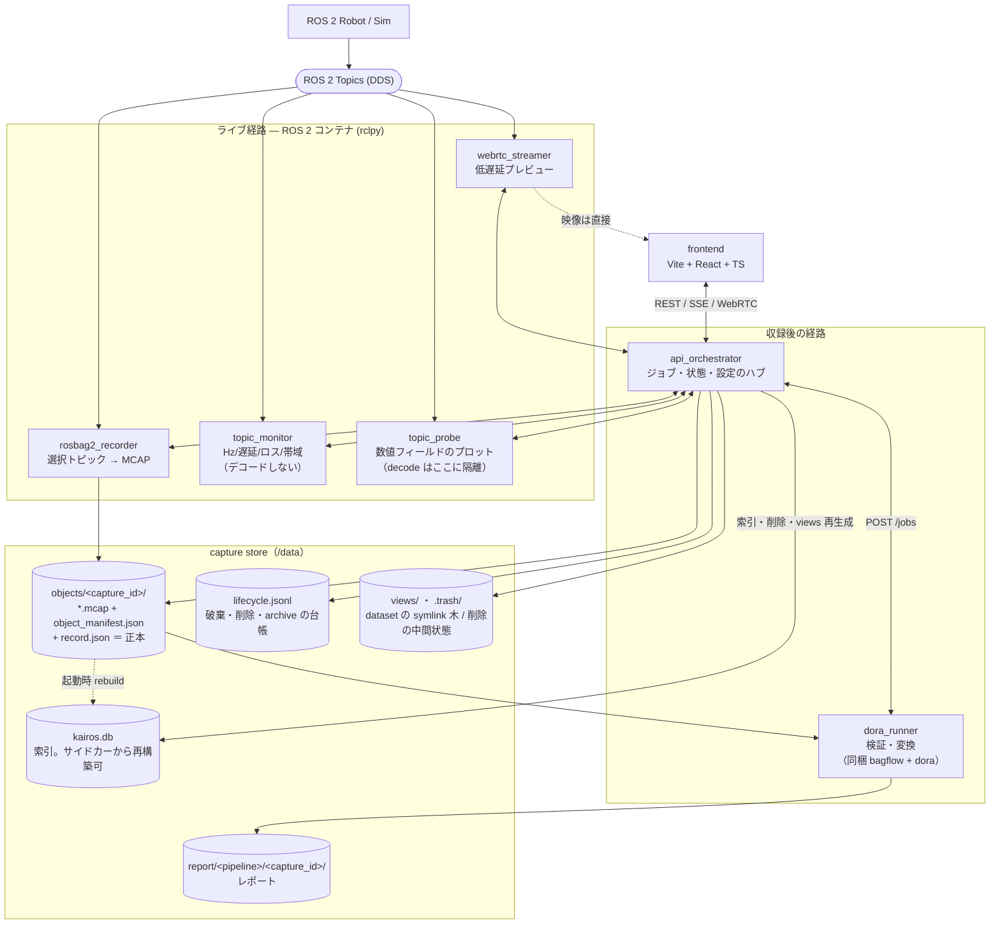
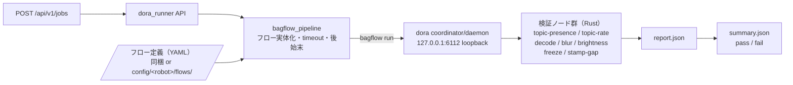

# kairos

**English: [README.md](README.md)**

ROS 2 のロボットデータを **収録・監視・検証・変換** するシステムです。収録の正本フォーマットは
**MCAP** であり、ライブ映像・ライブメトリクス・事後検証はすべてこの「正本」を中心に構成されます。

> **ステータス:** 全 7 サービス（frontend 含む）＋ UI 駆動の受け入れテスト（`make test-e2e`）
> を実装済み。以下のアーキテクチャは `fig_const/` の図に基づきます。

## アーキテクチャ

**1 フォルダ = 1 コンテナ**。責務ごとにプロセスを分け、重い処理（デコード・検証）が
収録と監視に波及しないようにしています。



収録後の検証は **dora_runner コンテナの中だけ**で完結します（同梱の bagflow フローを
自前の dora coordinator 上で実行。詳細は [dora_runner 仕様](docs/specs/ja/dora_runner.md)）:



## サービス構成

| サービス | 役割 |
|---|---|
| [rosbag2_recorder](docs/specs/ja/rosbag2_recorder.md) | 選択した ROS 2 トピックを **MCAP** に記録する。唯一の正本（source of truth）。 |
| [topic_monitor](docs/specs/ja/topic_monitor.md) | 軽量・非破壊なライブ健全性メトリクス（Hz / 遅延 / 欠落 / ロス / 帯域）。ペイロードは**デコードしない**。 |
| [topic_probe](docs/specs/ja/topic_probe.md) | 選択トピックの**数値フィールド**をライブプロットする汎用プローブ。decode は本サービスに**隔離**し、収録・監視に波及させない。 |
| [webrtc_streamer](docs/specs/ja/webrtc_streamer.md) | 低遅延のカメラ**プレビュー**（ROS 2 image → ブラウザ）。記録パスではない。 |
| [api_orchestrator](docs/specs/ja/api_orchestrator.md) | 単一の API ハブ。ジョブのライフサイクル・状態・設定・結果集約を担う。 |
| [dora_runner](docs/specs/ja/dora_runner.md) | 収録後の**検証・変換**パイプライン。検証は**実 dora 上の bagflow フロー**（同梱）。有効: `fast_validation` / `full_validation` / `loss_report` / `video_check` / `signal_report`。 |
| [frontend](docs/specs/ja/frontend.md) | backend-driven な Web UI（UI 表記は英語）。役割タブ構成（Console v2）: Collect / Review / Datasets / Validation / Monitor / Settings。 |

## 仕様ドキュメント

各サービスの詳細仕様は [docs/specs/ja/](docs/specs/ja/README.md) を参照してください。収録データの配置・耐久性（`objects/<capture_id>`・サイドカー・削除・DB の再構築）はサービス横断の土台として [capture_store](docs/specs/ja/capture_store.md) にまとめてあります。`fig_const/` を基にした**設計の正本**です（未記載事項は推奨設計として確定。認証は不要）。

## 始め方

### 必要なもの

- **Docker** / **Docker Compose**（全サービスをまとめて起動する場合）。
- ローカル検証用のサンプル rosbag（**MCAP**）を `data/` 配下に配置（例: `data/airoa-moma-mcap/<episode>/`）。`data/` と `*.mcap` は gitignore（コミットしない）。
- 単体テストを直接走らせる場合のみ: **uv**（Python）と **Node.js + npm**（frontend）。

### 全サービスの起動（Docker）

```bash
make build                    # イメージを作る（初回とコード変更時だけ。ネットが要る）
make up                       # 起動（detached）。機体は ROBOT で選択（既定 airoa_hsr）
# あるいは素の docker compose で:
cp .env.example .env          # 必要に応じて編集
docker compose build
docker compose up
```

> **`make up` はビルドしません**（起動するだけ）。ビルドは変更が無くてもネットワークを必要とする
> ため、`up` が毎回ビルドしていると**ネットの無い現場でスタックを起動できない**からです。コード変更を
> 反映したいときは `make rebuild <サービス名>`、上流のベースイメージごと更新したいときは
> `make build-pull` を使います。イメージが 1 つも無いマシンへの持ち込みは
> [オフラインのマシンで動かす](#オフラインのマシンで動かすイメージの持ち込み)を参照。

全サービスは host networking で起動します。ROS 2 サービス（`recorder` / `monitor` / `streamer`）は
ホストの DDS グラフ（`ROS_DOMAIN_ID=0`）を共有し、純 Python サービス（`orchestrator` / `dora_runner`）
と frontend は `localhost:<port>` で相互に到達します（認証なし・LAN 前提）。

### 設定ファイル `.env` はどちらを使う？（初めての人向け）

設定はすべて 1 つの `.env` ファイルにまとめます。そのひな形（テンプレート）が **2 つ**あるので、
**自分の使い方に合う方をコピー**して使ってください。中身を全部読む必要はありません。

| あなたの使い方 | コピーするひな形 | 最初に触る行 |
|---|---|---|
| **① 1 台の PC で全部動かす** — 普通の使い方。サンプル bag のお試しもこれ | `.env.example` | ほぼそのままで動く。別ロボットを使うときだけ `ROBOT=` |
| **② ロボットとは別の「録画用 PC」から記録する** — ロボット本体に負荷をかけたくない人向け | `.env.split.example` | `ROBOT_IP=`（ロボットの IP アドレス）だけ |

> **迷ったら ①** です。まず 1 台で動かし、必要になってから ② を検討してください。
> どちらの場合も、編集するのは**コピーして作った `.env`**（ひな形の `*.example` ではありません）。
> `.env` は Git にコミットされません（`.gitignore` 済み）。

**① 1 台構成（`.env.example`）** — ほとんどの人はこちら。
```bash
cp .env.example .env     # コピーするだけ。中身はほとんど触らずに動く
make up
```
- サンプル bag（HSR）を試すだけなら **編集は不要**です（既定の `ROBOT=airoa_hsr` がサンプルに一致）。
- **別のロボットを使うとき**だけ、`.env` の `ROBOT=` をそのロボット名に変えます（設定一式は `config/<robot>/`
  に置く。手順は下の「追加ロボットを使う」）。
- （上級）ロボットが Cyclone DDS を使っている場合だけ `RMW_IMPLEMENTATION=rmw_cyclonedds_cpp` に変えます。
  それ以外の項目（ポート番号など）は普段そのままで構いません。

**② 別 PC 録画（`.env.split.example`）** — ロボットを圧迫せず記録したい人向け。
```bash
# 「録画用 PC」で:
cp .env.split.example .env
# .env を開いて、ROBOT_IP をロボットの LAN IP に書き換える（触るのは基本ここだけ）
make recording-up
# ※ ロボット側では別途 `make robot-up` を実行する（記録・監視などロボットに触るサービスはロボット上で動く）
```
- 実際に編集するのは **`ROBOT_IP` の 1 行だけ**です。ほかの接続先はそれを自動で参照します。
- なぜ 2 台に分けるのか、注意点（時刻同期・権限・映像の到達経路など）は
  [デプロイ構成](docs/specs/ja/deployment_topology.md) を参照してください。

`.env` の全項目のリファレンスは [config 仕様](docs/specs/ja/config.md) にあります（普段は上記だけ分かれば十分です）。

### Make ショートカット

長いコマンドを毎回打たずに済むよう、ルートに `Makefile` を用意しています。`make` だけで全
ターゲット一覧が出ます。サービス名は**位置引数**（複数可）。機体設定は単一 `ROBOT`（既定
`airoa_hsr`）で選び、`make` が `config/<robot>/`（committed）／ `config/local/<robot>/`（gitignored）を
解決して各サービスへ渡す（`.env` の陳腐化パスを回避）。

| コマンド | 内容 |
|---|---|
| `make up` / `make down` / `make ps` | スタックの起動（**build しない**）/ 停止削除 / 状態 |
| `make build monitor` / `make build` | サービス build（位置引数で1つ / 無指定や `all` で全部） |
| `make rebuild frontend` | build + 強制再作成（コード変更を反映）**＝コンテナを新しくするコマンド** |
| `make build-pull` | 上流のベースイメージを取り直して build（ネット必須） |
| `make images-save` / `make images-load` | イメージを 1 ファイルに書き出す / 読み込む（オフライン機への持ち込み） |
| `make restart monitor orchestrator` | サービス再起動 |
| `make logs streamer` | ログ追従 |
| `make config-reload` / `make config-show` | `config/*.yaml` 編集の反映（monitor+orchestrator 再起動）/ 現在の config 表示 |
| `make rosbag` / `make rosbag-loop` / `make table` | サンプル bag 単発再生 / ループ再生 / 全 topic の Hz テーブル |
| `make load` | 負荷概観: CPU（コア単位**と**マシン単位の両方）/ NIC 実測スループットとリンク利用率 / 実測 DDS 帯域 / データディスク空き |
| `make smoke` / `make smoke-record` | 通し確認（PASS/FAIL）/ 記録 start/stop 込み |
| `make test` / `make test-py` / `make test-fe` / `make lint` / `make fmt` | テスト・lint・整形 |
| `make test-e2e` | UI からの受け入れテスト（実ブラウザ + 実スタック + bag 再生）。**イメージはビルドしない** — 先に `make build` |

別ロボットを使う場合は `make up ROBOT=<robot>` のように `ROBOT` を切り替えます（`make` が
`config/<robot>/`（committed）/ `config/local/<robot>/`（gitignored）を解決して各サービスへ渡す）。
別 bag は `make rosbag BAG=/data/<robot>/<run>` のように上書きできます。

### オフラインのマシンで動かす（イメージの持ち込み）

**ビルドは変更が無くてもネットワークを使います**（BuildKit がベースイメージ等をレジストリに解決しに
行くため）。そのため `make up` は**起動だけ**にしてあり、イメージが既にあるマシンならネットワークに
一切触れずに起動できます。

イメージが 1 つも無いマシン（新しい実機・現場の PC）には、ビルドさせるのではなく**ファイルとして
持ち込みます**。`make up` は起動前に**ローカルだけで**必要なイメージの有無を確認し、無ければ何が
足りないかを表示して止まります（compose に任せると build か pull でネットを掴みに行き、オフライン
では原因の分からないまま固まるため）。

**イメージだけでは足りません。** `make` と compose が読むリポジトリ、そして `.gitignore` 済みの
`.env` / `config/local/<robot>/` / `deploy/msgs_overlay/<robot>/` も要ります（`git clone` 自体が
ネット必須）。**rsync でディレクトリごと運べば `.gitignore` 済みのファイルも一緒に行く**ので、
実務上は「①イメージを焼く → ②リポジトリを rsync → ③現地で load して起動」の 3 手です。

```bash
# ① ネットワークのあるマシンで（イメージ一覧は compose から自動導出されるのでズレません）
make images-save                    # 全サービス + 再生/確認ハーネス -> kairos-images.tar.gz
make robot-images-save              # ロボット側の 4 サービスだけ（split 構成）
make recording-images-save          # 録画 PC 側の 3 サービスだけ（split 構成）

# ② リポジトリを丸ごと運ぶ（除外必須。素の scp -r は data/ を巻き込んで数十 GB になる）
rsync -av \
  --exclude='/data/*' \
  --exclude='.venv/' \
  --exclude='node_modules/' \
  --exclude='/deploy/msgs_overlay/*/build/' \
  --exclude='/deploy/msgs_overlay/*/log/' \
  --exclude='/backups/' --exclude='*.tar.gz' \
  ~/kairos/ <user>@<host>:~/kairos/
scp kairos-images.tar.gz <user>@<host>:~/

# ③ 持ち込んだマシンで
make images-load IMAGES_FILE=~/kairos-images.tar.gz
make up                             # あるいは make robot-up
make smoke                          # 動作確認（ハーネスも同梱されているので通る）
```

除外の理由と実測値（この構成での測定値。環境で変わります）:

| 対象 | サイズ | なぜ除外 / 必要 |
|---|---|---|
| `data/` | **20 GB** | 録画とサンプル bag。現地では空でよい |
| `.venv` ×8・`node_modules` | 約 950 MB | ホスト側の開発用。イメージの中に別途入っている |
| overlay の `build/` `log/` | 65 MB | colcon の中間生成物。**`install/` だけ**あればよい |
| **除外後の実転送量** | **40 MB**（`.git` 込み・9,337 ファイル） | |

`--exclude='/data/*'` を `/data/` ではなく `/data/*` にするのは**意図的**です。`data/` ディレクトリ
自体は空で存在させる必要があります — 無いと `./data:/data` バインドマウントを Docker が root 所有で
作ってしまい、非 root で動く orchestrator が書けなくなります。

この rsync で `.env` / `config/local/<robot>/` / `deploy/msgs_overlay/<robot>/install/` が実際に
運ばれることは dry-run で確認済みです。`install/` が未ビルドなら現地で `make msgs-build`（ローカルの
recorder イメージ内で `colcon build` するだけなのでネット不要）。split 構成なら現地で `.env` の
`*_HOST` / `ROBOT_IP` を実機の IP に直します。

出力先は `IMAGES_FILE=` で変えられます。実測: robot-edge の 4 イメージ = **384 MB / 約 35 秒**、
全サービス + ハーネスの 8 イメージ = **562 MB**（共通レイヤは 1 回だけ保存されるので、数だけ増えても
あまり膨らみません）。`make images-save` には**再生/確認ハーネス**（`make smoke` / `make rosbag` /
`make table` が使うイメージ。別 compose プロジェクトなので取りこぼしやすい）も含めてあります —
「現地で何も出てこない」を切り分けるときに使うものが、まさにその現地でビルドを要求してくるのを
避けるためです。

> **アーキテクチャに注意**: イメージは CPU アーキテクチャごとに別物です。amd64 で焼いたものは arm64
> の実機では動きません。実機がネットワークに繋がるうちにそこでビルドしておくか、
> `docker buildx build --platform linux/arm64` で焼いてください。

上流のベースイメージ（`ros` / `python` / `node`）を新しくしたいときは、ネットワークのある場所で
`make build-pull` を実行してから ① をやり直します。

### 追加ロボットを使う（カスタムメッセージ型を含む）

新しいロボットを足す手順。標準メッセージ型だけのロボットは 1〜3 のうち overlay 部分が不要です。

1. **config を用意**: `config/template/` を `config/local/<robot>/` にコピーして編集する
   （`recording/` `stream/` `validation/` `validators/` の4 aspect。少なくとも `recording/default.yaml` の
   `default_topics` をそのロボットの実トピックに合わせる）。詳細は [`config/`](config/README.ja.md)。
2. **（カスタム型を使うロボットのみ）メッセージ overlay をビルド**: そのロボットの非標準メッセージ
   パッケージ（例 `<robot>_msgs`）の typesupport が無いと、recorder / monitor / bag 再生のいずれも
   該当トピックを**無言で取りこぼす**（標準型のみ流れる）。bag が**複数の**カスタムパッケージを使う場合は
   **その全て**を用意する（一つでも欠けるとそのパッケージのトピックは落ちる）。ベンダ提供の msg ソースを
   `deploy/msgs_overlay/<robot>/src/<pkg>/` に置いてからビルドする（手順は [`deploy/msgs_overlay/`](deploy/msgs_overlay/README.md)）:
   ```bash
   make msgs-build MSGS_OVERLAY_DIR=./deploy/msgs_overlay/<robot>
   ```
3. **起動**（overlay を渡す。カスタム型が無ければ `MSGS_OVERLAY_DIR` は不要）:
   ```bash
   make up ROBOT=<robot> MSGS_OVERLAY_DIR=./deploy/msgs_overlay/<robot>
   ```
4. **bag 再生にも overlay が要る**: `ros2 bag play` はカスタム型を publish するのに typesupport が必要なので、
   再生側にも同じ overlay を渡す:
   ```bash
   MSGS_OVERLAY_DIR=./deploy/msgs_overlay/<robot> BAG=/data/<robot>/<run> \
     docker compose -f deploy/test/compose.yaml run --rm rosbag_player
   ```
5. **スモーク**: `smoke.sh` は既定で同梱 HSR の bag を見るため、追加ロボットでは bag と overlay を明示する:
   ```bash
   env BAG=/data/<robot>/<run> MSGS_OVERLAY_DIR=./deploy/msgs_overlay/<robot> bash deploy/test/smoke.sh
   ```
   なお `make table`（topic_table）は overlay を読まないので、追加ロボットのカスタム型の Hz は表示されない。
   確認は monitor の `GET /metrics`、または再生時に表示される `ros2 bag info` を使う。

### 主なエンドポイント（既定ポート）

| サービス | ポート | 例 |
|---|---|---|
| api_orchestrator | 8000 | `GET /api/v1/config` / `POST /api/v1/record/start` / `GET /api/v1/events`（SSE）/ `POST /api/v1/jobs` |
| topic_monitor | 8001 | `GET /metrics` / `GET /topics` / `GET /metrics/stream`（SSE）/ `GET /alerts` |
| webrtc_streamer | 8002 | `POST /stream/start` / `POST /stream/offer` |
| topic_probe | 8003 | `GET /topics` / `GET /fields` / `GET /stream`（SSE） |
| rosbag2_recorder | 8010 | `POST /record/start` / `POST /record/stop` / `GET /record/status` |
| dora_runner | 8020 | `POST /jobs` / `GET /jobs/{id}/result` / `POST /validation/templates/generate` |

frontend は nginx で配信（既定 `8080`）。UI は起動時に `GET /api/v1/config` を取得し、スキーマ・実行時設定を
backend 駆動で描画します（タブは Console v2 の役割 6 タブ = Collect / Review / Datasets / Validation / Monitor / Settings で固定）。

### 典型的な利用フロー

1. **トピックを流す**: 実ロボット/シミュレータを接続するか、サンプル bag を再生する。
   ```bash
   # 流れている topic を“見える化”（全 topic の Hz/帯域/件数を定期表示）
   docker compose -f deploy/test/compose.yaml run --rm topic_table
   # サンプル bag を ROS 2 グラフへ再生（別ターミナル・単発再生）
   docker compose -f deploy/test/compose.yaml run --rm rosbag_player
   # 繰り返し再生（連続で流し続ける）
   LOOP=--loop docker compose -f deploy/test/compose.yaml run --rm rosbag_player
   # 別の bag を指定
   BAG=/data/airoa-moma-mcap/000730 docker compose -f deploy/test/compose.yaml run --rm rosbag_player
   ```
2. **記録**: UI（Collect タブ）または `POST /api/v1/record/start {"topics":"all"}` で開始 → MCAP が
   `/data/objects/<capture_id>/` に生成される（停止は `POST /api/v1/record/stop`）。`capture_id` は
   recorder が発行する UUIDv7 で、パス・API・DB のすべてがこれをキーにする（`run_id` は表示名）。ヘッダの
   **OP チップ（データ取得者）** と Collect の **Task（タスク名）** を入れると、その内容＋トピック・件数・開始/終了が
   MCAP と同じディレクトリの `object_manifest.json` に保存され、Review タブでも表示される。
   収録は **Review タブから削除**できる（Exclude → Discard / Delete の 2 段階。削除は `.trash` 経由で行われ、
   **カタログには墓標の行が残る**ので「どこへ行ったのか」は後から答えられる）。recorder は出力を
   `chmod 0777` するので、ホスト側（コンテナ外）からも sudo なしで削除できる — ただし**それは削除としては扱われない**。
   kairos の外で消えたコピーは `missing_unmanaged` として警告に出る（黙って消えない）。
3. **監視 / プレビュー**: `GET /metrics` でライブ健全性（Hz / 欠落 / 帯域）、`/stream` でカメラの
   WebRTC プレビュー。UI では Collect タブがカメラプレビューと収録操作を、Monitor タブがトピック健全性
   （**グラフ上の全 topic を常時表示**し、監視対象は live Hz を重ねる）を担う。サンプル bag の Hz は既定の `ROBOT=airoa_hsr` で出る（どの
   topic を録る/監視するかは機体ごとに [`config/`](config/README.ja.md) で定義。Monitor タブの Rec
   チェックに事前選択として反映）。
4. **収録後の検証・処理**（`POST /api/v1/jobs {capture_id, pipeline}`、`dora_runner` 経由）:
   - `fast_validation` — 必須トピックの過不足を検証 → `/data/report/fast_validation/<capture_id>/summary.json` に `pass`/`fail`。
   - `loss_report` — トピックごとのロス推定（Review タブの「Run loss report」）。
   - `video_check` — カメラトピックの mp4 プレビュー（Review タブ。`GET /api/v1/files/...` で再生）。
5. **データセット編成**（Datasets タブ）: 収録を dataset に**入れる／外す**（`POST /api/v1/datasets/{id}/members`）。
   データセットは DB 上の集合で、**収録の実体は 1 バイトも動かない**ので、入れ直しも掛け持ちも自由です。
   人間が辿れる symlink 木は `data/views/<operator>/<task>/<dataset>/<NNN>` に生成されます。

### テスト / 結合テスト

- **単体テスト**: `make test`（= Python 各サービス `uv run --extra test pytest` + frontend `npm run build && npm test && npm run lint`）。
- **受け入れテスト（UI から・実スタック）**: `make test-e2e`。専用ポート・専用 data dir の実スタックを立て、
  ループ再生した実 bag を相手に、実ブラウザ（Playwright）で frontend を駆動します。5 シナリオ = 録画→digest 完了 /
  Review 保存と競合拒否 / Discard と ledger の墓標 / `kairos.db` を消しての復元 / `rm -rf` → SUSPECT → Repair。
  開発者の `make up` とは**併存**します（ポートも data dir も別）。
  **`make test-e2e` はイメージをビルドしません**（`make up` と同じ規則）。コードを変えたら先に `make build` を
  実行してください — 忘れると、コンテナの中の**古いコード**に対して green が出ます。
- **スモークテスト（PASS/FAIL を表示）**: スタック起動後に `make smoke`（= `bash deploy/test/smoke.sh`）。
  health → `GET /api/v1/config` の `default_topics` → topic discovery → monitor の live metrics を順に検証して
  結果を出力します（`make smoke-record` で記録 start/stop も実行）。「テストしたのに何も出ない」を解消する入口です。
- **可視化付き再生**: `make table`（全 topic の Hz/帯域を定期表示）と `make rosbag` / `make rosbag-loop`（再生）。

詳しいコマンド・確認済みレシピは [AGENTS.md](AGENTS.md) の「ビルド / テスト / 実行コマンド」を参照してください。

## リリース

バージョニングは [SemVer](https://semver.org/) に従います。現在のバージョンはルートの
[`VERSION`](VERSION) ファイル（正本）で、履歴は [`CHANGELOG.md`](CHANGELOG.md) にあります。

- **CI**（`.github/workflows/`）が `develop`・`main` への push / PR ごとに検証します:
  Python 単体テスト（共有ライブラリ + Python 6 サービス）・frontend の build/test/lint・
  Ruff lint + format・`docker compose config` 検証。recorder の実 `ros2 bag record`
  往復テストは（ROS 2 ツールチェーンが必要なため）別の **ROS integration** ワークフローで実行します。
- **再現可能なイメージ**: 各サービスは依存を committed な `uv.lock` から導入し
  （`uv sync --frozen`、`>=` の再解決なし）、ベースイメージは patch タグ + digest で固定します。
  `make build` / `make up` はイメージを `kairos-*:$(cat VERSION)` でタグ付けします
  （エクスポートされた `KAIROS_VERSION` 経由）。素の `docker compose build` は `:dev` にフォールバックします。

リリースの切り方:

1. [`VERSION`](VERSION) を更新（例: `0.1.0` → `0.2.0`）。
2. [`CHANGELOG.md`](CHANGELOG.md) の **Unreleased** の内容を新しい `## [x.y.z] - <日付>`
   見出しへ移し、空の Unreleased セクションを新設。
3. コミットしてタグを push: `git tag -a vX.Y.Z -m "kairos vX.Y.Z" && git push --tags`。
4. `make build` でそのタグの `kairos-*:X.Y.Z` イメージが生成される。

## ドキュメントの言語ルール

**日本語が正本**です。日本語ファイル（`*.ja.md`）を編集し、英語版（`*.md`）は日本語の変更に**手動で追随**させて
再生成します。英語版は手で編集しないでください。

例外として、コーディングエージェント向けの [`AGENTS.md`](AGENTS.md) と [`CLAUDE.md`](CLAUDE.md) は**日本語のみ**
（英語ミラーを作りません）。

## コントリビュート

- コード・コメント・コミットメッセージは英語で記述します。
- 作業上の取り決め・規約は [AGENTS.md](AGENTS.md) を参照してください（コーディングエージェント・人間の共通ルールの正本。Claude Code は [CLAUDE.md](CLAUDE.md) から `@AGENTS.md` で読み込みます）。
