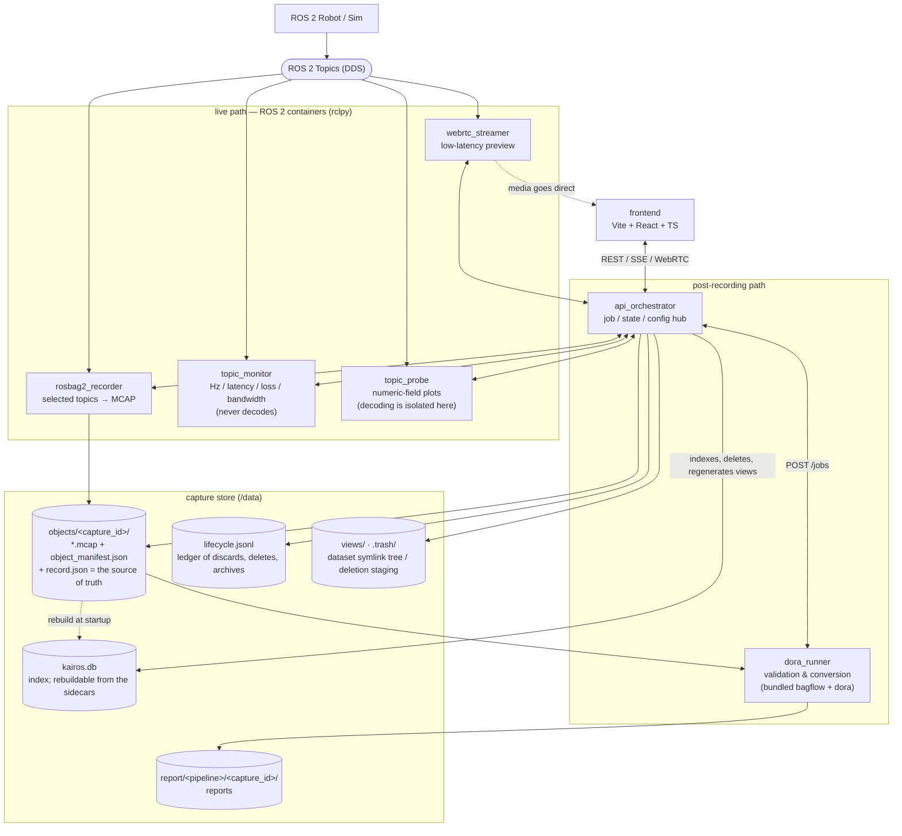
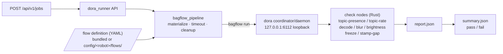

<!-- AUTO-GENERATED from README.ja.md. Do not edit by hand — edit the Japanese source and run /sync-docs. -->
# kairos

**日本語: [README.ja.md](README.ja.md)**

A system that **records, monitors, validates, and converts** ROS 2 robot data. The canonical
recording format is **MCAP**, and live video, live metrics, and post-hoc validation are all
organized around this "source of truth."

> **Status:** All 7 services (frontend included) plus the UI-driven acceptance suite
> (`make test-e2e`) are implemented. The architecture below is based on the `fig_const/` diagrams.

## Architecture

**1 folder = 1 container.** Responsibilities are split across processes so that heavy work
(decoding, validation) never bleeds into recording and monitoring.



Post-recording validation is contained **entirely inside the dora_runner container** (a bundled
bagflow flow run on its own dora coordinator; see the
[dora_runner spec](docs/specs/en/dora_runner.md)):



## Service composition

| Service | Role |
|---|---|
| [rosbag2_recorder](docs/specs/en/rosbag2_recorder.md) | Records selected ROS 2 topics to **MCAP**. The single source of truth. |
| [topic_monitor](docs/specs/en/topic_monitor.md) | Lightweight, non-intrusive live health metrics (Hz / latency / gaps / loss / bandwidth). Does **not decode** payloads. |
| [topic_probe](docs/specs/en/topic_probe.md) | A generic probe that live-plots **numeric fields** of selected topics. Decoding is **isolated** to this service so it doesn't affect recording or monitoring. |
| [webrtc_streamer](docs/specs/en/webrtc_streamer.md) | Low-latency camera **preview** (ROS 2 image → browser). Not a recording path. |
| [api_orchestrator](docs/specs/en/api_orchestrator.md) | The single API hub. Handles job lifecycle, state, configuration, and result aggregation. |
| [dora_runner](docs/specs/en/dora_runner.md) | Post-recording **validation & conversion** pipeline. Validation runs as a bundled **bagflow flow on real dora**. Enabled: `fast_validation` / `full_validation` / `loss_report` / `video_check` / `signal_report`. |
| [frontend](docs/specs/en/frontend.md) | A backend-driven Web UI (UI labels in English). Role tabs (Console v2): Collect / Review / Datasets / Validation / Monitor / Settings. |

## Specification docs

For the detailed spec of each service, see [docs/specs/en/](docs/specs/en/README.md). How recorded data is laid out and kept durable (`objects/<capture_id>`, sidecars, deletion, rebuilding the DB) is collected in [capture_store](docs/specs/en/capture_store.md) as the cross-service foundation. Based on `fig_const/`, this is the **canonical design** (unspecified items fixed as recommended designs; no authentication).

## Getting started

### Requirements

- **Docker** / **Docker Compose** (to start all services together).
- Place sample rosbags (**MCAP**) under `data/` for local verification (e.g. `data/airoa-moma-mcap/<episode>/`). `data/` and `*.mcap` are gitignored (not committed).
- Only when running unit tests directly: **uv** (Python) and **Node.js + npm** (frontend).

### Start all services (Docker)

```bash
make build                    # build the images (first time and after code changes; needs network)
make up                       # start (detached). Robot selected via ROBOT (default airoa_hsr)
# or with plain docker compose:
cp .env.example .env          # edit as needed
docker compose build
docker compose up
```

> **`make up` does not build** (it only starts). Building needs the network even when nothing changed,
> so an `up` that always built could not bring the stack up **in the field with no network**. To apply
> code changes use `make rebuild <service>`; to refresh the upstream base images too, `make build-pull`.
> For a machine with no images at all, see
> [Running on an offline machine](#running-on-an-offline-machine-carrying-the-images-in).

All services start with host networking. The ROS 2 services (`recorder` / `monitor` / `streamer`)
share the host DDS graph (`ROS_DOMAIN_ID=0`), and the pure-Python services (`orchestrator` / `dora_runner`)
and the frontend reach each other at `localhost:<port>` (no authentication; LAN assumed).

### Which `.env` file do I use? (for first-time users)

All settings live in a single `.env` file. There are **two** templates for it, so
**copy the one that matches how you plan to use kairos**. You do not need to read the whole thing.

| How you use it | Template to copy | The first line you touch |
|---|---|---|
| **① Run everything on one PC** — the normal case, and how you try the sample bag | `.env.example` | Works almost as-is. Change `ROBOT=` only when using a different robot |
| **② Record from a separate "recording PC"** — for people who don't want to load the robot itself | `.env.split.example` | Only `ROBOT_IP=` (the robot's IP address) |

> **When in doubt, pick ①.** Get it running on one PC first, then consider ② when you need it.
> In both cases, you edit the **`.env` you copied** (not the `*.example` template).
> `.env` is not committed to Git (it is `.gitignore`d).

**① Single-PC (`.env.example`)** — most people use this.
```bash
cp .env.example .env     # just copy it; it runs with almost no edits
make up
```
- To just try the sample bag (HSR), **no edits are needed** (the default `ROBOT=airoa_hsr` matches the sample).
- Only when **using a different robot**, change `ROBOT=` in `.env` to that robot's name (put its config set under
  `config/<robot>/`; see "Using additional robots" below).
- (Advanced) Only when the robot uses Cyclone DDS, change `RMW_IMPLEMENTATION=rmw_cyclonedds_cpp`.
  The other items (port numbers, etc.) can normally stay as they are.

**② Separate recording PC (`.env.split.example`)** — for recording without loading the robot.
```bash
# On the "recording PC":
cp .env.split.example .env
# Open .env and set ROBOT_IP to the robot's LAN IP (basically the only line you touch)
make recording-up
# ※ On the robot, run `make robot-up` separately (the services that touch the robot — recording,
#   monitoring, etc. — run on the robot)
```
- The only line you really edit is **`ROBOT_IP`** (the other destinations reference it automatically).
- For why it is split across two machines and the caveats (time sync, permissions, video reachability, etc.),
  see [Deployment topology](docs/specs/en/deployment_topology.md).

A full reference for every `.env` key is in the [config spec](docs/specs/en/config.md) (day to day, the above is enough).

### Make shortcuts

To avoid typing long commands every time, a `Makefile` is provided at the root. Just `make` prints the
full list of targets. Service names are **positional** (multiple allowed). A robot's config is
selected with a single `ROBOT` (default `airoa_hsr`); `make` resolves `config/<robot>/` (committed) /
`config/local/<robot>/` (gitignored) and passes the paths to each service (avoiding the stale path in `.env`).

| Command | What it does |
|---|---|
| `make up` / `make down` / `make ps` | Start the stack (**does not build**) / stop & remove / status |
| `make build monitor` / `make build` | Build a service (positional for one / no arg or `all` for all) |
| `make rebuild frontend` | Build + force re-create (apply code changes) — **the "refresh the container" command** |
| `make build-pull` | Build pulling fresh upstream base images (needs network) |
| `make images-save` / `make images-load` | Write the images to one file / load them (carrying them to an offline machine) |
| `make restart monitor orchestrator` | Restart services |
| `make logs streamer` | Follow logs |
| `make config-reload` / `make config-show` | Apply `config/*.yaml` edits (restart monitor+orchestrator) / show current config |
| `make rosbag` / `make rosbag-loop` / `make table` | Sample bag single playback / loop playback / Hz table for all topics |
| `make load` | Load overview: CPU (per-core **and** per-machine) / measured NIC throughput + link utilization / measured DDS bandwidth / data disk free |
| `make smoke` / `make smoke-record` | End-to-end check (PASS/FAIL) / with record start/stop |
| `make test` / `make test-py` / `make test-fe` / `make lint` / `make fmt` | Test, lint, format |
| `make test-e2e` | Acceptance tests from the UI (real browser + real stack + bag replay). **Does not build images** — run `make build` first |

To use a different robot, switch `ROBOT` like `make up ROBOT=<robot>` (`make` resolves `config/<robot>/`
(committed) / `config/local/<robot>/` (gitignored) and passes them to each service). For a different bag,
override like `make rosbag BAG=/data/<robot>/<run>`.

### Running on an offline machine (carrying the images in)

**A build uses the network even when nothing changed** (BuildKit resolves the base images and the
Dockerfile frontend against the registry). That is why `make up` only **starts**: on a machine that
already has the images, bringing the stack up touches the network not at all.

For a machine with no images at all (a fresh robot, a field PC), carry them over **as a file** instead
of making it build. `make up` checks — using local information only — that the images it needs are
present, and stops naming the missing ones if they are not (left to compose, a missing image means
either a build or a pull, so offline it just hangs on the network with no useful message).

**Images alone are not enough.** The repository `make` and compose read has to travel, and so do the
gitignored `.env`, `config/local/<robot>/` and `deploy/msgs_overlay/<robot>/` (`git clone` itself needs
the network). **rsync of the directory carries the gitignored files along with it**, so in practice
this is three steps: build the archive, rsync the tree, load and start.

```bash
# 1. where there IS network (the image list is derived from compose, so it cannot drift)
make images-save                    # all services + the replay/inspection harness
make robot-images-save              # only the robot-edge 4 (split deployment)
make recording-images-save          # only the recording-host 3 (split deployment)

# 2. carry the repository (excludes are mandatory — a plain `scp -r` drags data/ along, tens of GB)
rsync -av \
  --exclude='/data/*' \
  --exclude='.venv/' \
  --exclude='node_modules/' \
  --exclude='/deploy/msgs_overlay/*/build/' \
  --exclude='/deploy/msgs_overlay/*/log/' \
  --exclude='/backups/' --exclude='*.tar.gz' \
  ~/kairos/ <user>@<host>:~/kairos/
scp kairos-images.tar.gz <user>@<host>:~/

# 3. on that machine
make images-load IMAGES_FILE=~/kairos-images.tar.gz
make up                             # or make robot-up
make smoke                          # check it works (the harness travelled too)
```

Why each exclusion, with measured sizes (from this setup — yours will differ):

| What | Size | Why excluded / needed |
|---|---|---|
| `data/` | **20 GB** | Recordings and sample bags. Empty is fine on site |
| 8× `.venv` + `node_modules` | ~950 MB | Host-side dev only; the images carry their own |
| overlay `build/` + `log/` | 65 MB | colcon intermediates — only **`install/`** is needed |
| **actually transferred** | **40 MB** (incl. `.git`, 9,337 files) | |

`--exclude='/data/*'` rather than `/data/` is **deliberate**: the `data/` directory itself must exist
and be empty. Without it Docker creates the `./data:/data` bind mount root-owned, and the orchestrator
(which runs non-root) cannot write to it.

A dry run confirms this rsync really carries `.env`, `config/local/<robot>/` and
`deploy/msgs_overlay/<robot>/install/`. If `install/` has not been built, run `make msgs-build` on the
target machine (just `colcon build` inside the local recorder image — no network). For a split
deployment, fix `*_HOST` / `ROBOT_IP` in `.env` to the real robot's IP on site.

Change the destination with `IMAGES_FILE=`. Measured: the 4 robot-edge images → **384 MB in about
35 s**; all services plus the harness (8 images) → **562 MB** (shared layers are stored once, so the
count matters less than it looks). `make images-save` deliberately includes the **replay/inspection
harness** (the image behind `make smoke` / `make rosbag` / `make table` — easy to miss because it is a
separate compose project): the tools you reach for to work out why nothing is coming out should not
themselves demand a build on the machine where you have no network.

> **Architecture matters**: images are per-arch. One built on amd64 will not run on an arm64 robot —
> build there while it still has network, or use `docker buildx build --platform linux/arm64`.

To refresh the upstream base images (`ros` / `python` / `node`), run `make build-pull` where there is
network and redo step 1.

### Adding a robot (including custom message types)

Steps to add a new robot. A robot with only standard message types can skip the overlay parts of 1–3.

1. **Prepare config**: copy `config/template/` to `config/local/<robot>/` and edit it (the four aspects
   `recording/` `stream/` `validation/` `validators/`; at minimum set `default_topics` in
   `recording/default.yaml` to the robot's actual topics). Details: [`config/`](config/README.md).
2. **(Custom-type robots only) build the message overlay**: without the typesupport of the robot's
   non-standard message packages (e.g. `<robot>_msgs`), the recorder / monitor / bag playback all
   **silently drop** those topics (only standard types flow). If the bag uses **several** custom
   packages, prepare **all of them** (any one missing drops that package's topics). Place the vendor's
   msg sources under `deploy/msgs_overlay/<robot>/src/<pkg>/`, then build (procedure:
   [`deploy/msgs_overlay/`](deploy/msgs_overlay/README.md)):
   ```bash
   make msgs-build MSGS_OVERLAY_DIR=./deploy/msgs_overlay/<robot>
   ```
3. **Start up** (pass the overlay; `MSGS_OVERLAY_DIR` is unnecessary when there are no custom types):
   ```bash
   make up ROBOT=<robot> MSGS_OVERLAY_DIR=./deploy/msgs_overlay/<robot>
   ```
4. **Bag playback also needs the overlay**: `ros2 bag play` needs typesupport to publish custom types, so
   pass the same overlay to the player:
   ```bash
   MSGS_OVERLAY_DIR=./deploy/msgs_overlay/<robot> BAG=/data/<robot>/<run> \
     docker compose -f deploy/test/compose.yaml run --rm rosbag_player
   ```
5. **Smoke**: `smoke.sh` defaults to the bundled HSR bag, so for an added robot specify the bag and
   overlay explicitly:
   ```bash
   env BAG=/data/<robot>/<run> MSGS_OVERLAY_DIR=./deploy/msgs_overlay/<robot> bash deploy/test/smoke.sh
   ```
   Note that `make table` (topic_table) does not load the overlay, so an added robot's custom-type Hz is
   not shown. Use the monitor's `GET /metrics`, or the `ros2 bag info` printed at playback.

### Main endpoints (default ports)

| Service | Port | Examples |
|---|---|---|
| api_orchestrator | 8000 | `GET /api/v1/config` / `POST /api/v1/record/start` / `GET /api/v1/events` (SSE) / `POST /api/v1/jobs` |
| topic_monitor | 8001 | `GET /metrics` / `GET /topics` / `GET /metrics/stream` (SSE) / `GET /alerts` |
| webrtc_streamer | 8002 | `POST /stream/start` / `POST /stream/offer` |
| topic_probe | 8003 | `GET /topics` / `GET /fields` / `GET /stream` (SSE) |
| rosbag2_recorder | 8010 | `POST /record/start` / `POST /record/stop` / `GET /record/status` |
| dora_runner | 8020 | `POST /jobs` / `GET /jobs/{id}/result` / `POST /validation/templates/generate` |

The frontend is served by nginx (default `8080`). On startup the UI fetches `GET /api/v1/config` and
renders its schemas and runtime settings backend-driven (the tabs are the fixed Console v2 role tabs:
Collect / Review / Datasets / Validation / Monitor / Settings).

### Typical usage flow

1. **Stream topics**: connect a real robot/simulator, or replay a sample bag.
   ```bash
   # "see" the flowing topics (periodically show every topic's Hz/bandwidth/count)
   docker compose -f deploy/test/compose.yaml run --rm topic_table
   # replay a sample bag onto the ROS 2 graph (separate terminal; single playback)
   docker compose -f deploy/test/compose.yaml run --rm rosbag_player
   # loop playback (keep streaming continuously)
   LOOP=--loop docker compose -f deploy/test/compose.yaml run --rm rosbag_player
   # specify a different bag
   BAG=/data/airoa-moma-mcap/000730 docker compose -f deploy/test/compose.yaml run --rm rosbag_player
   ```
2. **Record**: start from the UI (Collect tab) or `POST /api/v1/record/start {"topics":"all"}` → an MCAP is
   created under `/data/objects/<capture_id>/` (stop with `POST /api/v1/record/stop`). The `capture_id` is a
   UUIDv7 issued by the recorder, and paths, the API, and the DB are all keyed by it (`run_id` is the display
   name). If you fill in the header's **OP chip (operator)** and Collect's **Task**, that content plus the
   topics, count, and start/end are saved to `object_manifest.json` in the same directory as the MCAP, and are
   also shown in the Review tab. A recording can be **deleted from the Review tab** (two steps: Exclude →
   Discard / Delete; the deletion goes through `.trash`, and **a tombstone row stays in the catalog**, so
   "where did it go?" can still be answered later). The recorder `chmod 0777`s its output, so it can also be
   deleted from the host side (outside the container) without sudo — but **that does not count as a deletion**.
   A copy that disappears outside kairos shows up as a `missing_unmanaged` warning (nothing vanishes silently).
3. **Monitor / preview**: live health (Hz / gaps / bandwidth) via `GET /metrics`, WebRTC camera preview via
   `/stream`. In the UI, the Collect tab owns the camera previews and recording controls, and the Monitor tab
   owns topic health (**always shows every topic on the graph**, overlaying live Hz on the monitored ones).
   The sample bag's Hz shows up with the default `ROBOT=airoa_hsr` (which topics to record/monitor is defined
   per robot in [`config/`](config/README.md); reflected as a pre-selection in the Monitor tab's Rec checks).
4. **Post-recording validation & processing** (via `POST /api/v1/jobs {capture_id, pipeline}`, through `dora_runner`):
   - `fast_validation` — validates the presence/absence of required topics → `pass`/`fail` in `/data/report/fast_validation/<capture_id>/summary.json`.
   - `loss_report` — per-topic loss estimation (the Review tab's "Run loss report").
   - `video_check` — mp4 preview of camera topics (Review tab; play via `GET /api/v1/files/...`).
5. **Organizing datasets** (Datasets tab): **add** recordings to a dataset or **take them out**
   (`POST /api/v1/datasets/{id}/members`). A dataset is a set in the DB, and **not one byte of the recording
   itself moves**, so re-adding a recording or having it belong to several datasets is free.
   A human-navigable symlink tree is generated at `data/views/<operator>/<task>/<dataset>/<NNN>`.

### Tests / integration tests

- **Unit tests**: `make test` (= each Python service `uv run --extra test pytest` + frontend `npm run build && npm test && npm run lint`).
- **Acceptance tests (from the UI, against a real stack)**: `make test-e2e`. It brings up a real stack on
  dedicated ports and a dedicated data dir and drives the frontend in a real browser (Playwright) against a
  real bag on loop playback. 5 scenarios = record → digest completes / Review save and conflict rejection /
  Discard and the ledger tombstone / deleting `kairos.db` and recovering / `rm -rf` → SUSPECT → Repair.
  It **coexists** with a developer's `make up` (different ports, different data dir).
  **`make test-e2e` does not build images** (the same rule as `make up`). After changing code, run `make build`
  first — forget it and you get a green run against the **stale code** inside the containers.
- **Smoke test (prints PASS/FAIL)**: after the stack is up, `make smoke` (= `bash deploy/test/smoke.sh`).
  It validates health → `GET /api/v1/config` `default_topics` → topic discovery → the monitor's live metrics, in order, and
  prints the result (`make smoke-record` also runs record start/stop). This is the entry point for resolving "I tested it but nothing comes out."
- **Playback with visualization**: `make table` (periodically show Hz/bandwidth for all topics) and `make rosbag` / `make rosbag-loop` (playback).

For detailed commands and verified recipes, see "ビルド / テスト / 実行コマンド" in [AGENTS.md](AGENTS.md) (Japanese).

## Releases

Versioning follows [SemVer](https://semver.org/). The current version is the root
[`VERSION`](VERSION) file (single source of truth); the history is in
[`CHANGELOG.md`](CHANGELOG.md).

- **CI** (`.github/workflows/`) gates every push / PR to `develop` and `main`:
  Python unit tests (shared lib + all six Python services), the frontend
  build/test/lint, Ruff lint + format, and `docker compose config` validation.
  The recorder's real `ros2 bag record` round-trip runs in the separate
  **ROS integration** workflow (it needs the ROS 2 toolchain).
- **Reproducible images**: each service installs its dependencies from the
  committed `uv.lock` (`uv sync --frozen`, no `>=` re-resolution), and base images
  are pinned by patch tag + digest. `make build` / `make up` tag the images
  `kairos-*:$(cat VERSION)` (via the exported `KAIROS_VERSION`); a bare
  `docker compose build` falls back to `:dev`.

To cut a release:

1. Bump [`VERSION`](VERSION) (e.g. `0.1.0` → `0.2.0`).
2. In [`CHANGELOG.md`](CHANGELOG.md), move the **Unreleased** entries under a new
   `## [x.y.z] - <date>` heading and start a fresh empty Unreleased section.
3. Commit, then tag and push: `git tag -a vX.Y.Z -m "kairos vX.Y.Z" && git push --tags`.
4. `make build` then produces the `kairos-*:X.Y.Z` images for that tag.

## Documentation language rule

**Japanese is the source of truth.** Edit the Japanese files (`*.ja.md`), and regenerate the English
versions (`*.md`) by hand to match the Japanese changes. Do not author content in the English versions directly.

The coding-agent instructions — [`AGENTS.md`](AGENTS.md) and [`CLAUDE.md`](CLAUDE.md) — are an exception:
they are **Japanese only** and have no English mirror.

## Contributing

- Write code, comments, and commit messages in English.
- For working conventions and rules, see [AGENTS.md](AGENTS.md) (Japanese) — the canonical rules shared by
  coding agents and humans. Claude Code loads it from [CLAUDE.md](CLAUDE.md) via `@AGENTS.md`.
