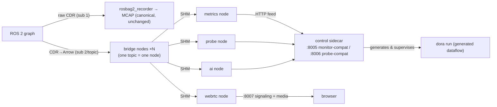

# dora_live — live DDS ingest and fan-out via the dora bridge

> Status: implemented (opt-in via compose profile `live`). Not started by the default stack.
> Verified by: the ~/ros2_to_dora benchmark (28 cells) + 3 extra cells (Cyclone interop /
> rm_ros_interfaces real bridging / wired-LAN emulation) + a real-data E2E (looping bag graph,
> down to actual media reception).

## Purpose and position

Collapses the DDS subscriptions of every live consumer (metrics, probe, realtime analysis,
WebRTC preview) into **one subscription per topic**, fanned out over dora shared memory. The
recording side (rosbag2_recorder) keeps its **own independent subscription, unchanged** — if
dora_live dies entirely, the canonical MCAP path is untouched (safety lives in the topology).



## dora pinning policy (important)

- Released dora (0.5.0–1.0.0-rc.3) is **hard-wired to DDS domain 0** and cannot reach a real
  robot (variable ROS_DOMAIN_ID). We use a **commit-pinned source build of upstream main**
  (`DORA_COMMIT`, default `de261f77…`), which resolves `Ros2Context(domain_id)` arg >
  `ROS_DOMAIN_ID` env > 0 — any domain works.
- CLI and Python wheel are built **from the same commit** (mixing breaks the internal protocol).
- **Exit condition**: switch back to the PyPI wheel once an official release ships domain_id
  support (dora-rs/dora#1626).

## HTTP contracts (all compatibility surfaces — frontend untouched)

| Port | Compatible with | Switch lever |
|---|---|---|
| `DORA_LIVE_PORT` (8005) | all topic_monitor routes (/topics /metrics(+SSE) /metrics/pause·resume /alerts(+SSE) /incidents /readyz) | orchestrator's `TOPIC_MONITOR_PORT` |
| `DORA_LIVE_PROBE_PORT` (8006) | all topic_probe routes (/topics /fields /sample /stream /readyz) | nginx probe proxy env |
| `DORA_LIVE_WEBRTC_PORT` (8007) | webrtc_streamer's 4 routes (/stream/start·stop·status·offer) | nginx `WEBRTC_HOST`/`WEBRTC_PORT` |

dora_live-specific additions: `GET /live/status` (manifest, pending, dataflow liveness, honesty
markers), `POST /live/reload` (re-derive the manifest), `GET /live/events` (realtime-analysis
events), `POST /internal/*` (dataflow-node → control feed surface; not a public contract).

## Shared stats engine

Metric math, alerting and baseline learning reuse `kairos_common.monitoring` (extracted from
topic_monitor) **unmodified**; dora_live merely injects a different `TopicSubscriber`
implementation (`DoraFeedSubscriber` = HTTP feed + rclpy graph poller). No duplicated logic.

## Dataflow generation discipline

- **Every node-to-node input carries `queue_size` (default 1000)** — the generator refuses to
  emit without it and a unit test lints the graph (dora's default queue drops bursty
  high-rate messages; proven and counter-proven in bench §4.3).
- Nodes launch through the `run_node.sh` wrapper (dora execs `*.py` with the system python,
  ignoring the venv — bench-proven bypass).
- The webrtc node's inputs are **CompressedImage topics only** (realman's raw Image stays off
  the bus — beyond ~55 MB/s it enters the RustDDS fragmentation-loss regime; ruled 2026-07-22).

## Self-checks and honesty

- 15 s discovery settle (cross-RMW SPDP matching takes 6–8 s: Cell A).
- **A wrong domain surfaces as "0/N allowlist topics visible"** — pending stays non-empty and
  readyz goes 503. The service never pretends to be healthy.
- Type resolution comes ONLY from `.msg` on AMENT_PREFIX_PATH, lazily; failures arrive as
  RuntimeError event values (Cell B). The bridge guards them so **unbridged topics still get
  Hz** (size/stamp unavailable).
- The API states `metrics_source: dora_bridge` (Hz measured after the bridge, not on the wire)
  and `dds_samples_lost_available: false` (no RMW events; loss detection rests on the
  expected_hz shortfall floor).
- Realtime analysis ships **demo-grade detectors** (every event carries `grade: "demo"`):
  joint-speed z-score (5 s cooldown) and stamp lag (>1 h classified as clock-domain
  difference, info).
- Crash-loop guard: 3 abnormal `dora run` exits within 120 s → degraded (readyz 503).

## Custom types (realman etc.)

Mount the overlay prebuilt by `make msgs-build` at `/opt/msgs_overlay` (same contract as
recorder/monitor/probe). The entrypoint sources its setup.bash to extend AMENT_PREFIX_PATH;
the bridge parses the `.msg` files directly (Cell B: 660/660 field values matched).

## Startup and switchover

```bash
# opt-in start (default stack unchanged)
docker compose --profile live up -d dora_live
# staged switchover (env only, no code changes):
#   monitor: orchestrator TOPIC_MONITOR_PORT=8005
#   probe:   nginx probe proxy target -> 8006
#   webrtc:  WEBRTC_HOST/WEBRTC_PORT -> 8007
```

Note: when starting via raw `docker compose` (not `make`), beware the stale relative
`RECORDING_CONFIG` in `.env` (set `RECORDING_CONFIG=/config/<robot>/recording/default.yaml`
explicitly).

## Known limitations (TBD)

- Real-NIC / physical two-host wired verification is pending (Cell C was veth+netem emulation).
- A live plugin contract (extending dora_runner's kairos_plugin.yaml to live lanes) is not yet
  designed — the analysis lane currently ships built-in demo detectors only.
- `/metrics/stream` SSE keeps the monitor's full-snapshot-per-tick shape (not diffs).
