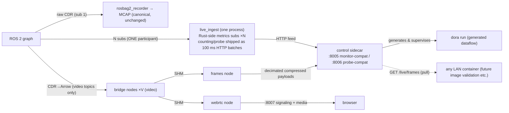

# dora_live — live DDS ingest and fan-out via the dora bridge

> Status: implemented (opt-in via compose profile `live`). Not started by the default stack.
> Verified by: the ~/ros2_to_dora benchmark (28 cells) + 3 extra cells (Cyclone interop /
> rm_ros_interfaces real bridging / wired-LAN emulation) + a real-data E2E (looping bag graph,
> down to actual media reception).

## Purpose and position

Collapses the DDS subscriptions of every live consumer into **one subscription per topic**.
The payload lanes (video/frames) fan out over dora shared memory; metrics/probe are
**self-reported by the bridge over HTTP** (see the field-scale rework below). The
recording side (rosbag2_recorder) keeps its **own independent subscription, unchanged** — if
dora_live dies entirely, the canonical MCAP path is untouched (safety lives in the topology).

**Placement is the robot side** (`compose.robot.yaml` in the split; ruled 2026-07-22 —
supersedes the earlier recording-host placement). Same topology as the legacy trio
(monitor/streamer/probe) it replaces: live topics NEVER cross the wire as DDS; only
lightweight derived data leaves the robot (metrics JSON on :8005/:8006, encoded WebRTC on
:8007). The division of labor is fixed as:

- **dora_live (on the robot)** = non-destructive, lightweight, streaming work. It may hold
  monitoring plus anything whose result settles in the window between one recording's end and
  the next one's start. The operator is still teleoperating (scene reset) during that window —
  the robot is NOT idle — so the budget is cut conservatively, bursts included.
- **dora_runner (on the recording PC)** = all heavy analysis/conversion. Post-MCAP processing
  after rsync; anything with a heavy burst goes here regardless of timing.



**Field-scale FINAL form (late 2026-07-22, the user-ruled live_ingest layout)**:
counting (metrics/probe) collapses into **ONE live_ingest process / ONE DDS
participant** hanging N `Ros2MetricsSubscription`s — provided by the **carried
dora patch** (`services/dora_live/dora-metrics.patch`, `git apply`'d in the
source-pinned build). Rust extracts arrival/size/stamp per message; Python
drains a compact batch every 100 ms into ONE `/internal/samples` POST. Payload
only materialises in Python through the probe tap (latest-wins, while
watched). Only video topics keep per-topic bridges (SHM to webrtc/frames).
The external APIs (:8005/:8006) are unchanged.

Measured (29 topics, ~970 msg/s synthetic, same conditions across generations):

| Generation | container CPU | PIDS | MEM |
|---|---|---|---|
| central metrics/probe consumers | 118-136% | 2833 | 3.9GB |
| per-topic self-reporting bridges | 130.7% | 2726 | 3.9GB |
| **live_ingest (current)** | **30%** | **495** | **0.65GB** |

The per-topic process fleet (RustDDS participant ×29 = fixed floor + DDS
participant-index consumption) was the real bottleneck; one participant also
structurally removes the participant-index exhaustion. The patch is proposed
upstream (dora-rs/dora#2801) — drop it once an equivalent ships in a release.

## dora pinning policy (important)

- Released dora (0.5.0–1.0.0-rc.3) is **hard-wired to DDS domain 0** and cannot reach a real
  robot (variable ROS_DOMAIN_ID). We use a **commit-pinned source build of upstream main**
  (`DORA_COMMIT`, default `de261f77…`), which resolves `Ros2Context(domain_id)` arg >
  `ROS_DOMAIN_ID` env > 0 — any domain works.
- CLI and Python wheel are built **from the same commit** (mixing breaks the internal protocol).
- **Exit condition**: switch back to the PyPI wheel once an official release ships domain_id
  support (dora-rs/dora#1626).

## HTTP contracts (all compatibility surfaces — frontend untouched)

| Port | Compatible with | Switch lever |
|---|---|---|
| `DORA_LIVE_PORT` (8005) | all topic_monitor routes (/topics /metrics(+SSE) /metrics/pause·resume /alerts(+SSE) /incidents /readyz) | orchestrator's `TOPIC_MONITOR_PORT` |
| `DORA_LIVE_PROBE_PORT` (8006) | all topic_probe routes (/topics /fields /sample /stream /readyz) | nginx probe proxy env |
| `DORA_LIVE_WEBRTC_PORT` (8007) | webrtc_streamer's 4 routes (/stream/start·stop·status·offer) | nginx `WEBRTC_HOST`/`WEBRTC_PORT` |

dora_live-specific additions: `GET /live/status` (manifest, pending, dataflow liveness, honesty
markers), `POST /live/reload` (re-derive the manifest), `GET /live/events` (analysis event
ring — the extension seam, below), `GET /live/frames` + `GET /live/frame?topic=` (the
live-frames lane, below), `POST /internal/*` (dataflow-node → control feed surface; not a
public contract).

## LIVE_CONFIG — live topic set, QoS, video lane (`config/<robot>/live/default.yaml`)

The config surface that **separates the live topic set from the recording set**
(RECORDING_CONFIG). Every field is optional with a robot-independent default, so **a new
robot works with NO live config** (the key to low-effort onboarding). `make` derives
`LIVE_CONFIG` from ROBOT like every other aspect. Annotated template:
[`config/template/live/default.yaml`](../../../config/template/live/default.yaml).

| Key | Default | Meaning |
|---|---|---|
| `topics` | `null` | `null` = inherit the recording `default_topics`; an explicit list fully replaces it |
| `extra_topics` | `[]` | live-only additions (monitored but not recorded, etc.) |
| `exclude` | `[]` | glob patterns removed from the final set (still recorded; kept off the bridge) |
| `qos_overrides` | `[]` | per-topic subscription QoS (first match wins). Falls back to the recording `topic_qos_overrides`, then **auto-match against the offered publisher QoS** (reusing the monitor's own `resolve_subscription_qos` — no second QoS brain) |
| `video` | `[]` | video-lane rules (first match wins); `codec: image\|ffmpeg\|raw\|off` |
| `video_defaults` | `{max_fps: 15, max_width: null, max_height: null}` | server-side defaults applied when the client's `/stream/start` omits a hint. **On HD cameras the `max_width` cap is the single biggest decode/encode CPU lever** (explicit client values always win) |
| `frames` | `{enabled: true, sample_hz: 2.0}` | live-frames lane (below): enablement + per-topic decimation rate |
| `queues` | `{metrics: null, probe: 4, webrtc: 2, frames: 2}` | **per-consumer queue depths**. Preview lanes are latest-wins, so shallow — a deep queue there turns a briefly-slow decoder into seconds of stale-frame lag + pinned shared memory (the choppy-preview field incident). NOTE: after the self-reporting rework the `metrics`/`probe` keys are **unused** (those edges no longer exist; still accepted for config compat) |
| `queue_size` | `1000` | former metrics-lane depth (unused after the rework; accepted only) |

- The auto-match input is the publishers' **real offered QoS** (reliability/durability/depth),
  collected by the rclpy graph poller via `get_publishers_info_by_topic`. The resolution lands
  in the bridge subscription (`BRIDGE_QOS`/`BRIDGE_QOS_DURABILITY`/`BRIDGE_QOS_DEPTH`) and in
  `/live/status` `qos`. If the pinned dora API rejects durability, the bridge degrades to
  volatile (logged loudly, never dies).
- Live metrics (Monitor-tab Hz/bandwidth) cover **exactly the live set**: an excluded recorded
  topic keeps recording but shows no live Hz (discovery still lists every topic).

### Video (WebRTC preview) lane and ffmpeg support

Topics not matched by a rule resolve **by message type** (robot-independent here too):

| Type | codec | Decode |
|---|---|---|
| `sensor_msgs/CompressedImage` | `image` | JPEG/PNG → cv2.imdecode (as before) |
| `ffmpeg_image_transport(_msgs)/FFMPEGPacket` | `ffmpeg` | H.264/HEVC/… → stateful PyAV decode: keyframe gating + auto-reset after a watch-gap (prevents mid-GOP join smear). The decoder is resolved from the `encoding` name (`libx264`/`h264_nvenc`/`hevc_*`/…) |
| raw `sensor_msgs/Image` | off by default | opt-in ONLY via an explicit `codec: raw` rule (bgr8/rgb8/mono8). Rationale for the default: >55 MB/s raw camera flow enters the RustDDS fragmentation-loss regime (bench-measured) |

- The generator ships the topic→codec map to the webrtc node as `DORA_LIVE_VIDEO_MAP` (JSON),
  also surfaced in `/live/status` `video`. Only watched topics are decoded (the wants() gate);
  the ffmpeg codec adds up to one GOP of first-frame latency after attach (keyframe wait).
- `FFMPEGPacket`'s `.msg` ships inside the dora_live image
  (`ros-<distro>-ffmpeg-image-transport-msgs`) — no per-robot overlay needed. Decoding uses
  the PyAV wheel (ffmpeg bundled); no apt ffmpeg dependency.

## Live-frames lane and the extension seam (ruled 2026-07-22)

Only the **robot-side half** of future off-robot image analysis (live image validation) is
implemented. The consumer (an image validator etc.) does not exist yet; this is the stable
contract it will attach to:

- **frames node**: among the video-lane topics it forwards `image` (JPEG/PNG as-is) and
  `ffmpeg` (**keyframes only** — a delta AU is undecodable through a decimated feed) at
  `sample_hz` (default 2.0) into the control sidecar. **raw is excluded** (forwarding would
  require a robot-side re-encode = budget violation). Nothing is ever decoded or re-encoded
  on the robot.
- **Pull contract** (:8005): `GET /live/frames` = per-topic metadata index (topic/codec/
  encoding/size/stamp_ns/recv_t/seq); `GET /live/frame?topic=` = latest payload (one slot,
  latest-wins; ETag=seq with `If-None-Match` → 304). **Pull, not push**, on purpose: the
  robot never needs a consumer's address (no new env dependency), a dead consumer costs the
  robot nothing, and the consumer paces its own intake. Nobody pulling = zero wire cost.
- **Practice example**: the minimal template for a custom dora node attached to the pull
  contract (grayscale, verified working) → [`docs/examples/grayscale/`](../../examples/grayscale/README.md).
- **Analysis event ring** (the extension seam): any lane node may push events to
  `POST /internal/analysis/events`; consumers poll `GET /live/events`. The built-in demo
  detectors (the old ai node) were **removed by ruling** — only this generic intake remains.
- **Design guidance for the future consumer (not built, TBD)**: the image validator lives on
  the recording PC (a streaming intake in dora_runner, or a separate container); results go
  to a separate `report/live_image/` namespace with `coverage: sampled` burned into every
  verdict so they can never overwrite the batch (exhaustive) validation; run attribution via
  time-window matching against the orchestrator's recording state, ambient live status
  between takes.

## Shared stats engine

Metric math, alerting and baseline learning reuse `kairos_common.monitoring` (extracted from
topic_monitor) **unmodified**; dora_live merely injects a different `TopicSubscriber`
implementation (`DoraFeedSubscriber` = HTTP feed + rclpy graph poller). No duplicated logic.
The feed's producer changed from one central metrics node to N bridges POSTing concurrently
(100 ms flush, batched); the `/internal/samples` contract and row shape are identical.

## Dataflow generation discipline

- **Every node-to-node input carries an explicit `queue_size`** — the generator refuses to
  emit without it and a unit test lints the graph (dora's default queue drops bursty
  high-rate messages; proven and counter-proven in bench §4.3). Depths are per consumer
  (the `queues` table above): deep where events are counted, shallow on latest-wins lanes.
- Nodes launch through the `run_node.sh` wrapper (dora execs `*.py` with the system python,
  ignoring the venv — bench-proven bypass).
- The webrtc node's inputs are **exactly the topics whose manifest entry resolved a video
  codec** (LIVE_CONFIG rules + type defaults; raw Image stays off the bus unless explicitly
  opted in with `codec: raw`).
- Any effective manifest change (topic set, resolved QoS, video lane) applies only through a
  dataflow restart (the graph is static per run). Re-derivation happens only on the pending
  retry cadence and `POST /live/reload` — publisher churn cannot flap it.

## Self-checks and honesty

- 15 s discovery settle (cross-RMW SPDP matching takes 6–8 s: Cell A).
- **A wrong domain surfaces as "0/N allowlist topics visible"** — pending stays non-empty and
  readyz goes 503. The service never pretends to be healthy.
- Type resolution comes ONLY from `.msg` on AMENT_PREFIX_PATH, lazily; failures arrive as
  RuntimeError event values (Cell B). The bridge guards them so **unbridged topics still get
  Hz** (size/stamp unavailable).
- The API states `metrics_source: dora_bridge` (Hz measured after the bridge, not on the wire)
  and `dds_samples_lost_available: false` (no RMW events; loss detection rests on the
  expected_hz shortfall floor).
- Crash-loop guard: 3 abnormal `dora run` exits within 120 s → degraded (readyz 503).

## Custom types (realman etc.)

Mount the overlay prebuilt by `make msgs-build` at `/opt/msgs_overlay` (same contract as
recorder/monitor/probe). The entrypoint sources its setup.bash to extend AMENT_PREFIX_PATH;
the bridge parses the `.msg` files directly (Cell B: 660/660 field values matched).

## Startup and switchover

```bash
# Single host — recommended: a single make knob (same _prefer_env pattern as
# ROBOT; persist with LIVE=1 in .env)
make up LIVE=1   # start dora_live + stop legacy monitor/probe/streamer + repoint
make up          # back to the legacy stack (dora_live stopped)

# Split — dora_live runs on the ROBOT. LIVE=1 in .env.split makes it sticky on both hosts
make robot-up LIVE=1       # [robot] recorder + dora_live (trio stopped)
make recording-up LIVE=1   # [recording PC] orchestrator/dora/frontend (proxies -> robot's 8005/8006/8007)
make robot-up LIVE=0       # [robot] back to the legacy trio (dora_live stopped)

# Manual (trial mode, legacy services keep running; caveats in .env.example):
docker compose --profile live up -d dora_live
TOPIC_MONITOR_PORT=8005 docker compose up -d orchestrator
WEBRTC_PORT=8007 TOPIC_PROBE_PORT=8006 docker compose up -d frontend
```

LIVE=1 STOPS the legacy trio because `TOPIC_PROBE_PORT` etc. double as the old
services' bind ports and the proxy targets — flipping the values while they
run collides ports on their next recreate.

Note: when starting via raw `docker compose` (not `make`), beware the stale relative
`RECORDING_CONFIG` in `.env` (set `RECORDING_CONFIG=/config/<robot>/recording/default.yaml`
explicitly).

## Known limitations (TBD — includes the 2026-07-22 independent-audit residue)

- **Physical two-host validation is pending** (single-host split rehearsal + netem emulation so
  far). The robot-side placement removed the live-DDS-over-the-wire concern (the remaining wire
  paths are HTTP proxying / WebRTC media / importer+rsync only). Remaining: the HTTP/media
  paths and rsync over two real machines, and a rerun on the real robot's domain with its msgs
  overlay.
- **The ffmpeg codec (FFMPEGPacket) and the raw opt-in are unverified against a real camera**
  (unit tests cover the PyAV round trip). First validation on real realman/aloha-style topics
  is required.
- **One topic = one bridge = one DDS participant**, so the live topic count consumes the
  host×domain participant-index space (a finite resource). Measured at 29 bridges:
  CycloneDDS nodes started afterwards fail with an opaque
  `RCLError: error creating node`. Under the robot-side placement the bridges share that
  index space with the robot's own nodes. Mitigations: the bundled `config/cyclonedds.xml`
  (`MaxAutoParticipantIndex=119`, wired as the compose `CYCLONEDDS_URI` default), or trim
  the bridge count via the live config `topics`/`exclude`. Cyclone also logs one type-hash
  USER_DATA WARN per bridge
  param-service endpoint (harmless but noisy). Collapsing to one participant awaits
  external-event attribution in upstream dora (TBD).
- **`DORA_LIVE_CPUS` (opt-in) caps the tokio-worker-thread floor.** Each bridge's tokio worker
  count scales with the cpu cores VISIBLE to the container (`num_cpus` reads sched_affinity), so on
  a many-core field host (64+ cores) the 29-bridge fleet balloons to 6000+ threads. Setting this env
  to a positive integer N makes the entrypoint pin process affinity to the first N cpus (every child
  inherits the mask), so each tokio runtime sizes to N and worst-case CPU is bounded too. A cgroup
  `cpus:` quota does NOT shrink `num_cpus`; only sched_affinity does. Suggested: 8-16 on a 64-core
  host; unset = unrestricted.
- **stamp_delay_ms is the true wall-clock staleness** (epoch->monotonic conversion at ingest).
  During bag replay it correctly reads as "time since recording" — hundreds of days; on a live
  robot it is transport latency in milliseconds. Stamp-delay alert thresholds will fire
  continuously during replay by construction.
- The live Monitor is a reduced variant: `dds_samples_lost` is always 0 (RustDDS exposes no RMW
  events) and some baseline-derived fields can stay null; loss detection rests on the
  expected_hz shortfall floor.
- The **robot half** of the live plugin contract is now fixed as the frames lane + event ring
  above. The **consumer half** (recording-PC image validator / a streaming intake in
  dora_runner) is neither built nor designed.
- `/metrics/stream` SSE keeps the monitor's full-snapshot-per-tick shape (not diffs).
- make resolves env from `.env` first (`_prefer_env`); split-specific values live in
  `.env.split` — only LIVE has a `.env.split` fallback so far. Beware double definitions.
