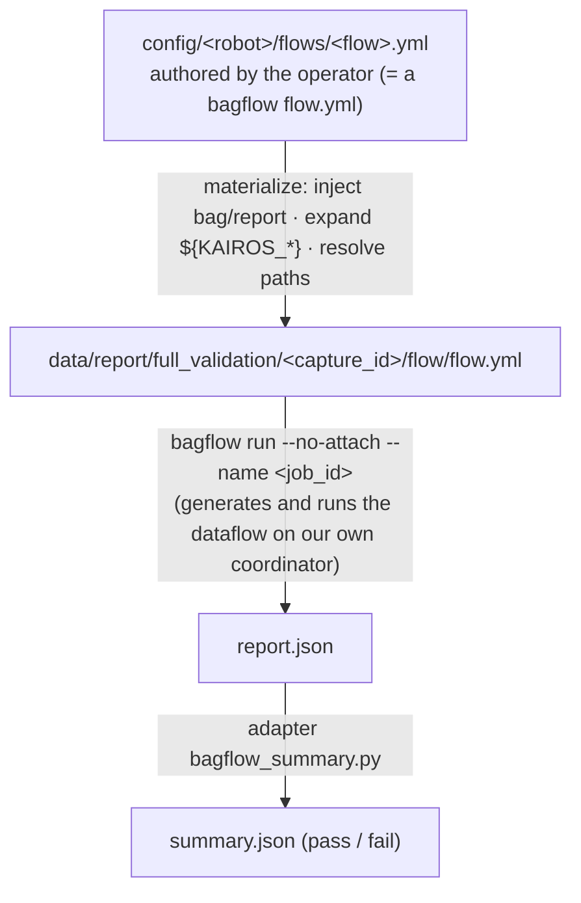
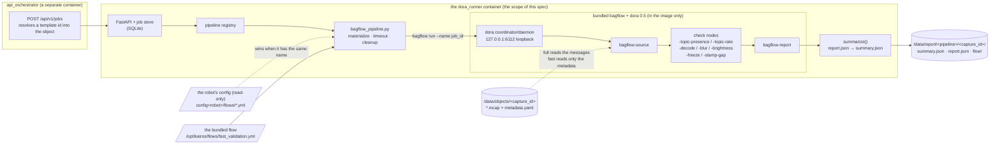

<!-- AUTO-GENERATED from docs/specs/ja/dora_runner.md. Do not edit by hand — edit the Japanese source and run /sync-docs. -->
# dora_runner specification

> Status: design finalized (**v2 = capture store support**). Based on `fig_const/dora.png`, with unspecified items fixed as recommended designs. Japanese is the source of truth (treat it as canonical). The English version `docs/specs/en/dora_runner.md` is an auto-generated mirror (do not edit it directly). **No authentication required.**

The post-recording **validation / conversion / extension processing pipeline** container (**dora**-based). Taking recorded MCAP as input, it runs validation, conversion, and **AI processing** as asynchronous jobs. All heavy processing is concentrated here, keeping `rosbag2_recorder` / `topic_monitor` lightweight. The design centers on **maximally leveraging dora's extensibility and AI integration**.

## Role

- Perform validation / conversion / extension (including AI) on recorded MCAP.
- Make each process assemblable as swappable, chainable parts.

## Design center: dora extensibility & AI integration

- Each process (validator / converter / **AI node**) is implemented as a **dora node (plugin)** and connected via a **dora dataflow (YAML)**.
- The **Plugin Registry** registers nodes, and the **Pipeline Registry** manages dataflows (= pipelines). **Adding a pipeline = adding a dataflow YAML + a node**, with no core changes needed.
- A node's **I/O is fixed as a contract**:
  - Input: `capture` (the `objects/<capture_id>` path / metadata / `object_manifest.json`), an MCAP message iterator (topic filter and time range can be specified), `params`.
  - Output: `metrics` (dict), `artifacts` (a list of generated-output paths), `report` fragments.
  - This lets nodes be freely swapped and chained.
- **Make AI integration a first-class citizen**: inference / auto-annotation / embedding & search indexing / quality scoring / training dataset conversion (e.g. **LeRobot** format) can be plugged in as **AI dora nodes**.
  - The node interface assumes model swapping (`params.model`, etc.). GPU usage is available (`--gpus` / environment variables). Messages can be batch-processed.
  - For reproducibility, the report records pipeline / node / model versions.
- Because it is a dora dataflow, streaming / distributed execution / node reuse all apply.

## Input

- `/data/objects/<capture_id>/*.mcap` (+ `metadata.yaml` / `object_manifest.json`) — **this is the only source resolution there is** ([capture_store](capture_store.md) §2)
- pipeline definitions (dataflow YAML)
- config ([config](config.md), validation templates, `config/<robot>/flows/*.yml` = `full_validation`'s validation flows)
- job record (originating from `api_orchestrator`)

### Relationship to the capture store (v2)

- **Every job's mandatory input is a `capture_id`** (changed from the old `run_id`). The `dataset_dir` param is retired — an export no longer moves the bag, so there is no "where it is while recording" and "where it is after export" to switch between in the first place.
- **Products land in `report/<pipeline>/<capture_id>/`**. Reports under an old `run_id` are thrown away.
- **Never write into `objects/<capture_id>/`.** dora_runner reads a capture and writes into `report/`, and creates nothing under `objects/` (not even a temp file). Because that holds, **dora_runner does not have to know about capture leases** (the orchestrator takes, renews and releases them on its behalf; [capture_store](capture_store.md) §7.1).
- If the capture is deleted its directory moves to `.trash`, and a job that was running **fails cleanly** (a late normal ending, not corruption).

## Constituent components

- **MCAP Loader** — reads with `mcap` + `mcap-ros2-support` (**no rclpy required**, file iteration). Obtains topic / type / timestamp / size, and decodes only when needed.
- **Plugin Registry** — registration and discovery of dora nodes (validator / converter / AI).
- **Pipeline Executor** — execution and ordering control of dora dataflows. Per-job timeout / resource limits.
- **Result Writer** — output of reports / converted products.
- **Job Status / Logs** — state, progress, and logs (SSE to `api_orchestrator`).

## Runnable pipelines (figure)

- `fast_validation` / `full_validation` / `dataset_convert` / `dataset_validation`
- **Implemented (`enabled=true`)**: these five — `fast_validation` / `full_validation` / `loss_report` / `video_check` / `signal_report` (below). `dataset_convert` / `dataset_validation` are interface and plugin slots only (`enabled=false`).
- **`dataset_export` / `dataset_archive` are retired** (v2). A dataset became a DB row with no physical move behind it ([capture_store](capture_store.md) §6), and archiving is carried by the orchestrator's per-capture endpoint (`POST /api/v1/captures/{id}/archive`). Moving files is no longer dora_runner's job.
- **Both validation gates (`fast_validation` / `full_validation`) depend on bundled binaries** (bagflow + the dora CLI). Outside the image (a source checkout / CI) they **degrade to `enabled=false` placeholders** whose description says why — we never advertise something that cannot run as runnable.
- All jobs are launched via `POST /jobs` (proxied by `api_orchestrator`). Each pipeline validates that the `capture_id` is a well-formed UUIDv7 to prevent path traversal.

## Implemented pipelines

- **`loss_report`** — robot-independent, config-free per-topic loss estimation. From the message times of a completed MCAP, it computes the **median interval** per topic and derives `loss ≈ 1 − actual/expected` (read-only, does not decode payloads). The clock **prefers the sender-side `publish_time` (DDS source timestamp)** to keep receive-side jitter (DDS transport, recorder scheduling/cache) out of the cadence estimate. publish_time is trusted only when every message carries a real source stamp (**non-zero** and **different from log_time**) AND the two clocks span the same recording window (within 2x); otherwise (older rosbag2's `pub==log`, a log/source mix, `0`, or offset publisher clocks) it falls back to the single receive-side `log_time` — so publish_time is never worse than before. Note this is an **inferred estimate, not a measurement**: publish_time cannot separate a source that stopped publishing from a message lost in transport before the recorder wrote it (a pre-record loss has no MCAP record, so its publish_time is gone too). **Which clock produced the numbers is stated per topic as `time_source`** (`"publish_time"` / `"log_time"`; honesty rule). Report: `data/report/loss_report/<capture_id>/summary.json`.
- **`video_check`** — on-demand (params `{topic}`) `CompressedImage`→mp4 preview. Generated with PyAV (`av` + `Pillow`), which are **lazily imported** so the service can start even when the packages are absent (when absent it becomes a clearly failed job). Output is `data/report/video_check/<capture_id>/<topic>.mp4`, served via `GET /api/v1/files/...`. The encode cap is params `max_frames` (**`0` = every frame**). The default comes from the `VIDEO_MAX_FRAMES` env (unset = `0` = the full episode — reviewers watch the whole take, the 2026-08-07 decision; set a cap only where encode time/disk actually hurts. A broken value falls back to "everything" — a preview that silently stops short is worse than a slow one). The fps-estimate cadence sample stays bounded independently of the cap (`FPS_SAMPLE_FRAMES`). A summary cut off at the cap carries `truncated: true` and the real total message count, and the UI shows a "head only" label plus a **Re-encode full episode** button (re-posting `{force: true, max_frames: 0}`). The playback fps is estimated from the frame-time cadence under the same rule as loss_report — **`publish_time` preferred, `log_time` fallback** (the clock used is stated as `fps_time_source` in the summary). The mp4 is encoded to a temp file and atomically renamed, so a re-encode that fails midway never corrupts an mp4 being served. The (capture_id, topic) cache is cap-aware (a truncated cache misses a full-length request; an untruncated one within the requested cap hits).
- **`signal_report`** — robot-independent, **generic** numeric time-series extraction (not JointState-specific; any message with numeric leaves — wrench / odom / cmd_vel, etc. — is in scope). It scans a completed MCAP once ("all numeric leaves in one pass") and walks each message's numeric leaves with the **same `field_introspect` logic** topic_probe's live Signals plotter uses (now shared in `libs/kairos_common`). Paths are dotted/indexed (`pose.position.x` / `position[2]`) — the **same vocabulary as the live view** (a value seen in the UI is addressable in the sidecar by the identical path). The field set is derived from each topic's **first message** (bagel-style episode-0 schema; a later message missing a leaf extracts to `null`), every numeric leaf value is extracted per message, and the aligned series is **downsampled by a uniform stride** so each topic emits at most `max_points` points (default 2000) — into one sidecar. **Image topics (`sensor_msgs/msg/Image` / `CompressedImage`) are excluded** (video_check's job), as are topics with no numeric leaves and topics absent from the recording; each is recorded with a reason in `skipped_topics`. A per-topic **continuity** score is computed from the **full-resolution** inter-arrival intervals (before downsampling): `1 - sum(gap - 1.5*median_interval for gaps > 1.5*median_interval)/duration` (clamped to `[0,1]`; `null` for fewer than 2 messages / zero duration). Using the median as the cadence baseline makes it robust to a handful of long gaps (only the **excess** of a gap beyond 1.5× the typical spacing counts, normalised by the total duration). Timestamps follow the same rule as loss_report / video_check — **`publish_time` preferred, `log_time` fallback** (the clock used is stated per topic as `time_source`). Output: `data/report/signal_report/<capture_id>/summary.json`. The frontend (Review "Data integrity") renders loss_events / bins / continuity as the aggregated timeline + event table + summary, synced against the video_check mp4 (**the numeric `fields` stay in the sidecar, but the v2 UI no longer draws the raw waveform chart** — removed 2026-07-15; live waveforms are topic_probe's Signals view). Sidecar shape:
  ```json
  {
    "pipeline": "signal_report", "version": "1.1.0", "capture_id": "...",
    "generated_at": "<iso8601>", "params": {"topics": null, "max_points": 2000},
    "span": {"duration_ns": 20034502235},
    "topics": {
      "/hsrb/joint_states": {
        "msg_type": "sensor_msgs/msg/JointState",
        "message_count": 1780, "start_ns": 0, "end_ns": 0,
        "start_offset_ns": 0,
        "continuity": 0.98,
        "continuity_definition": "1 - sum(gap - 1.5*median_interval for gaps > 1.5*median_interval)/duration, clamped to [0,1]",
        "time_source": "publish_time",
        "downsample": {"stride": 3, "points": 594},
        "t_ns": [ /* relative to start_ns (first 0), shared per topic, downsampled, <= max_points */ ],
        "fields": {"position[0]": [ /* aligned with t_ns, null for missing */ ], "...": []},
        "truncated_fields": 0,
        "loss_events": [
          {"start_ns": 5100000000, "duration_ns": 400000000, "estimated_lost": 11, "severity": "major"}
        ],
        "edges": {"start_delay_ns": 0, "end_early_ns": 120000000},
        "bins": {"count": 600, "bin_ns": 33390837, "densities": [3, 3, 0, 4]}
      }
    },
    "skipped_topics": {"/cam/image": "image topic (use video_check)"}
  }
  ```
  `t_ns` is emitted **relative to `start_ns`** (first element 0): absolute epoch nanoseconds (~1.75e18) exceed JS `Number.MAX_SAFE_INTEGER` (~9.007e15) and would be quantized, so the charted x-axis is episode-relative. `start_ns` / `end_ns` keep the absolute (chosen-clock) values as metadata (do not do sub-microsecond math on them in JS). `t_ns` is shared per topic (all of a topic's fields use the same arrival times — the time array is not duplicated per field). `truncated_fields` is the number of leaves dropped past the per-topic display cap (`field_introspect`'s 256-leaf bound).
  - **Loss-location visibility (v1.1)** — the same single scan also emits **loss events and time bins** for Review's aggregated integrity timeline (UI redesigned 2026-07-15 from a per-topic heatmap to a one-lane aggregate timeline + ranked event table; see [frontend.md](frontend.md) Review). First an **episode-global relative clock** is defined once: the global zero is the minimum full-resolution timestamp across all **included** topics and `span.duration_ns` is the maximum minus that minimum. The following three per-topic fields are on this global axis (small and JS-safe, like `t_ns`):
    - **`start_offset_ns`** = the topic's first timestamp − global zero.
    - **`loss_events`** — from the topic's **full-resolution** inter-arrival intervals (empty with fewer than 4 intervals). Threshold = 1.5× the median interval; each interval **over** the threshold is one event with `start_ns` = (previous message time − global zero), `duration_ns` = the interval, `estimated_lost` = `max(0, round(interval/median) - 1)`, `severity` = `"major"` when `estimated_lost >= 3` else `"minor"`. Empty when the median is 0 (a burst of identical stamps). The list is capped at 200 per topic (**largest-duration first**), and the overflow is stated as `"loss_events_truncated": <dropped>` (never silently truncated).
    - **`edges`** — `start_delay_ns` = topic first − global zero, `end_early_ns` = global end − topic last. Always present (0 when none).
    - **`bins`** — a fixed 600-way split of the global span (`bin_ns = ceil(duration/600)`; the last bin may be short). `densities` is the message count per bin from the full-resolution timestamps (their sum equals `message_count`). A topic with fewer than 2 messages emits `"bins": null`.

    The existing `t_ns` stays topic-relative (the chart contract is unchanged); the frontend converts chart-time ↔ the global axis with `start_offset_ns`.
- **`params.dataset_dir` is retired** (v2) — now that a dataset is logical and a recording's bytes never move, the need to switch between "where it is while recording" and "where it is after export" is gone. `loss_report` / `video_check` / `signal_report` all read `objects/<capture_id>`, and outputs / caches are fixed at `data/report/<pipeline>/<capture_id>/`. Putting a capture into a dataset or taking it out leaves both the reports and the mp4 cache valid as they are.

## `fast_validation`: the required-topic gate (**real dora execution**)

The default gate every recording passes through. It asks one question: does this bag contain the topics
the operator declared mandatory?

- **Validation template** (YAML / JSON): defines the topics required for that dataset / robot.
  ```yaml
  name: hsr_teleop_v1
  version: 1
  required_topics:
    - { name: "/joint_states", type: "sensor_msgs/msg/JointState" }  # type is optional
    - { name: "/camera/*/image_raw" }                                 # glob allowed
  # optional: expected_hz, min_duration_s, etc. can be added later
  ```
- **Automatic template generation**: generate a draft template from the topic list of an existing good run (`metadata.yaml` / MCAP) → a human selects and finalizes it (`POST /validation/templates/generate`, `validation.py`).
- **The execution engine is bagflow** (the same as `full_validation`; the section below is the shared
  specification for flows, verdicts and the runtime environment). The only difference is **whose flow it
  is**:
  - The flow **ships with the service**: `services/dora_runner/flows/fast_validation.yml` (in the image at
    `/opt/kairos/flows/`), so it works on a robot whose operator never authored a flow. Dropping
    `config/<robot>/flows/fast_validation.yml` **overrides it** (search order: robot config, then bundled).
  - It has exactly one check node, `bagflow-topic-presence`, and it **subscribes to no topic** — it judges
    from the `metadata.yaml` inventory alone. **Not a single MCAP byte is read, so the runtime does not
    depend on bag size** (4.4 GB costs about the same as 30 MB). Being fast is this pipeline's reason to
    exist, so nodes that decode belong in `full_validation` (i.e. in the robot's config).
  - `${KAIROS_REQUIRED_TOPIC_SPECS}` (`[{name, type}]`) carries the template to the node. `name` is a glob
    (fnmatch); `type` is optional (= any type). **A topic with 0 messages still counts as present** (a
    "record everything" bag permanently carries service-result topics with no messages); raise the flow's
    `MIN_MESSAGES` to demand a minimum count.
- Output `summary.json`: `{ template, result: "pass"|"fail", missing: [], extra: [], checked_at, engine: "bagflow", … }`.
  `missing` / `extra` / `result` are a **contract with the frontend** (the Validation screen's required-topic
  checklist reads them directly) and were kept unchanged across the port from the in-process implementation.
  What is new: `missing[].reason` (`topic not in bag` / `message type mismatch` / too few messages) and
  bagflow's own `checks` / `metrics`.
- **Migration from v1 (in-process)**: the Python `validator()` is gone; glob and type matching now live in
  `bagflow-topic-presence` (Rust, with unit tests). `summary.json` carries `version: "2.0.0"` and
  `engine: "bagflow"` (no such key exists in files written by v1).

## `full_validation`: declarative flows (**real dora execution**)

The pipeline that runs the heavy post-recording checks (decode, image quality, dropouts) **as a
YAML-declared flow on real dora**. The execution engine is shared with `fast_validation`: the bundled
**bagflow** (`services/dora_runner/bagflow/`; the upstream revisions and local modifications are in that
directory's `VENDOR.md`). The shared execution machinery (per-job materialization, timeouts, cleanup,
artifacts) lives in `bagflow_pipeline.py`; each pipeline supplies only *which flow to run* and *how to
summarize it*.



### How a flow relates to config

- A flow is **not a kairos dialect**. `config/<robot>/flows/*.yml` holds a bagflow flow.yml as-is (omit
  `bag:` / `report:` — kairos injects the capture's own). A job picks one with `params.flow` (default
  `default`), and `GET /pipelines` lists the **discovered flow names as an `enum`** in `params_schema`, so
  the auto-rendered form becomes a picker. A one-click button is just an entry in
  `validation_presets.yaml` (`{pipeline: full_validation, params: {flow: …}}`) — no UI change.
  **Flow search order**: `full_validation` looks only in the robot's config (picked with `params.flow`).
  `fast_validation` looks in the robot's config and then in the service's bundled flows
  (`/opt/kairos/flows/`), and has no `params.flow` — its flow name is fixed (`fast_validation`), so placing
  a file of that name in config IS the override mechanism.
- **`${KAIROS_*}` substitution** is the seam between the validation template (chosen under **Settings → Validation** in Console v2; the Config tab in the v1 UI) and the flow.
  Usable inside any string value:
  | Token | Contents |
  |---|---|
  | `${KAIROS_EXPECT_HZ}` | JSON `{topic: hz}`. **Required topics enter at `hz=0`** (= must exist, any rate: `bagflow-topic-rate` reports a topic missing from the bag as a failure and no rate can fall below 0). Topics matching `RECORDING_CONFIG`'s `expected_hz_patterns` are overridden with their real rate |
  | `${KAIROS_REQUIRED_TOPICS}` | JSON array of required topic **names** (for nodes that only need names) |
  | `${KAIROS_REQUIRED_TOPIC_SPECS}` | JSON array of `[{name, type}]` for the required topics (for a node that also checks the declared **message type**, i.e. `bagflow-topic-presence`). Used by `fast_validation`'s bundled flow |
  | `${KAIROS_CAPTURE_ID}` / `${KAIROS_BAG_DIR}` / `${KAIROS_REPORT_DIR}` / `${KAIROS_REPORT}` | the capture and its output locations (**`${KAIROS_RUN_ID}` is retired** — an unknown `${KAIROS_…}` is an error, so an old flow does not slip through silently, it fails) |
  - Required topics come from **`params.template` → (else) `RECORDING_CONFIG.validation.required_topics`**.
    The orchestrator resolves a template id into the full object for `full_validation` just as it does for
    `fast_validation`, so **choosing a template under Settings → Validation drives both pipelines from one
    definition**. There is deliberately **no** fallback to "a draft generated from the run itself" (that
    would make the check trivially true).
  - An unknown `${KAIROS_…}` is an **error** — never passed through silently.
- **Node `path` resolution**: a bare name (`bagflow-blur`) = a bundled binary; a relative path = relative to
  **the original flow file's directory** (so it survives materialization elsewhere); an absolute path is
  left alone.
- Materialization targets `data/report/.../flow/` rather than `/config` because bagflow/dora write **next to
  the flow file** (`.bagflow/dataflow.yml`, `.bagflow/out/<uuid>/log_<node>.txt`), and `/config` is a
  read-only mount.

### The verdict (where overall pass/fail lives)

bagflow only reports facts (per-node `ok`, per-edge `coverage`, the `incomplete` list of nodes that died).
**The overall verdict is decided by the kairos adapter** (`bagflow_summary.summarize`):

- any check with `ok: false` → **fail** (including the source's own `source_read`, so a truncated MCAP fails)
- a non-empty `incomplete` → **fail** (that node's checks never ran, so "no failures" would be a lie)
- no check results at all → **fail**
- `coverage` (how much of the bag each edge actually saw) below `params.min_coverage` → **fail**. The
  default `0` **reports the number without gating on it** (queue-overflow thinning always shows up in
  coverage — nothing goes missing silently).

Outputs land in `data/report/full_validation/<capture_id>/`: `summary.json` (the verdict), `report.json`
(bagflow's own), and `flow/` (the materialized flow plus each node's logs). The summary is shaped for the
generic `SummaryResult` (`metrics.coverage` is 0-100, which the Validation screen's coverage column reads
directly). The previous `summary.json` / `report.json` are **deleted before the flow starts**, so a failed
attempt can never leave last time's pass behind looking like "validated".

**Job failure vs. validation fail** (the existing kairos convention): if the flow runs and judges the
recording bad, that is a **succeeded job with `result: fail`**. If the flow could not produce a verdict
(missing input, invalid flow, a dataflow that crashed or timed out), the **job itself fails**, with the node
logs' location in `details` — and no summary.json is written, so the run stays un-validated.

### Runtime environment (four operational must-haves)

1. **Its own dora coordinator/daemon.** Every service uses `network_mode: host`, and dora 0.5's `dora up`
   can only bind the default control port (6012) — the same one any other dora on the host takes. dora_runner
   therefore starts `dora coordinator` / `dora daemon` itself on **loopback-only ports of its own**
   (`KAIROS_DORA_CONTROL_PORT` 6112 / `KAIROS_DORA_DAEMON_PORT` 53390 /
   `KAIROS_DORA_DAEMON_LISTEN_PORT` 53391). The bundled bagflow CLI targets them via
   `DORA_COORDINATOR_ADDR/PORT` (see `VENDOR.md`). On shutdown the service runs `dora destroy` against its
   own coordinator.
   **Ready means "a dataflow can start", not "the port accepts a connection".** The coordinator answers
   from the moment it binds, but `dora start` fails with `no unnamed daemon connections` until the
   **daemon has registered** with it — that window is real (measured). Startup therefore waits until
   `dora check` (alias of `system status`; exit 1 while the daemon is unregistered) succeeds. Without
   that wait the **first validation job after every service restart fails**, while `/readyz` is already
   returning 200.
2. **`shm_size` is mandatory.** dora places every inter-node message in `/dev/shm`, and **with Docker's
   64 MB default a node that runs out is killed without writing a single log line**. compose sets
   `shm_size: 2gb` (`DORA_RUNNER_SHM_SIZE`).
3. **Timeouts are layered** (shortest first, so the layer with the best diagnostics fires first):
   `bagflow run --timeout` (`KAIROS_BAGFLOW_TIMEOUT_S`, default 600s; prints which node's process is gone)
   → a +30s grace on the subprocess → the whole-job `KAIROS_DORA_JOB_TIMEOUT_S` (default 900s).
4. **Cleanup is by name.** dora 0.5 does not propagate a node's abnormal exit downstream, so the survivors
   wait for an end-of-stream that never comes and keep `/dev/shm` pinned. Every failure, timeout or cancel
   is followed by `dora stop --name <job_id>` (escalating to `--force` if it is still listed). dora 0.5 has
   no `stop --all`, and a "stop everything running" equivalent is deliberately **not** reimplemented (with
   our own coordinator, `dora destroy` is both equivalent and safe).

Bundled nodes (Rust): `bagflow-decode` (JPEG → raw frames) / `-blur` / `-brightness` / `-freeze` /
`-stamp-gap` / `-topic-rate` / `-topic-presence` (for `fast_validation`; added by kairos). Measured **0.56s wall, 3.7 CPU-s** (a 101s / 780MB / 29-topic bag with 3037 VGA
frames, warm, daemon already up). The **Python check nodes and the CUDA decoder are not bundled** (the
former need pyarrow/dora-rs/opencv; the latter measured slower than the CPU path on small images) — reasons
are recorded in `VENDOR.md`.

## Output

- `/data/report/<pipeline>/<capture_id>/` (`summary.json` / preview / logs)
- `/data/converted/<capture_id>/` (output of `dataset_convert`. e.g. training format)
- job record (the user-facing canonical store is **`api_orchestrator`'s SQLite**; dora_runner also persists its own internal state — see "Persistence and restart reconciliation" below)

## Persistence and restart reconciliation

- **Jobs and validation templates are persisted in SQLite** (`store.py`; default `<data_dir>/dora_runner.db`, beside the `report/` tree in the same data directory). It follows the same conventions as `api_orchestrator.store`: a `threading.RLock` serializes connection use, and `PRAGMA user_version` records the schema version. Previously this state was in-memory and was lost on process restart (release-readiness finding F4/MS-6).
- **Execution stays in-process** (this persists *state*, not a distributed queue). A running job is held as a live `JobRecord` (owning its `asyncio.Task`) and is **checkpointed** to its row on each state transition (queued → running → terminal); it is not written per log line. `logs_tail` is stored with the terminal row.
- **Restart reconciliation**: on startup (`create_dora_app`), any job left `queued`/`running` is resolved to a terminal `failed` state carrying the reason in its `summary` (`{result:"fail", reason:"interrupted", error:{code:"job_interrupted", message:"dora_runner restarted while the job was in flight."}}`), and an interrupted note is appended to `logs_tail`. `JobState` has no `interrupted` member, and `api_orchestrator`'s `run_job_to_completion` treats only succeeded/failed/canceled as terminal — so **interrupted collapses onto `failed` with the reason in the summary** (the same representation as timeout). `datasets._job_failure_reason` and the Validation tab's generic renderer then surface it to the user with no orchestrator/frontend changes.
- `GET /jobs/{id}/status` / `GET /jobs/{id}/result` prefer the live `JobRecord` and fall back to the SQLite row, so a job whose worker vanished with the old process still returns a terminal state and result.

## API (service-internal API; public exposure is via `api_orchestrator`)

- `POST /jobs` — `{ capture_id, pipeline, params? }` → `{ job_id }`
- `GET /jobs/{id}/status` — `{ state: "queued"|"running"|"succeeded"|"failed"|"canceled", progress, logs_tail }`
- `GET /jobs/{id}/result` — `{ summary, artifacts: [] }`
- `POST /jobs/{id}/cancel`
- `GET /pipelines` — list of available pipelines (dataflows)
- Validation templates: `GET/POST /validation/templates`, `POST /validation/templates/generate` (generate a draft from a capture; body `{ capture_id }`)
- `GET /healthz` / `GET /readyz`

## Data flow

MCAP → dora dataflow (validator / converter / AI nodes) → reports / converted dataset

What one validation job actually is (as of 2026-07-26; `fast_validation` and `full_validation` share the machinery):




## Design points

- validator / converter / AI are dora nodes (plugins). I/O is a contract.
- Heavy processing is asynchronous jobs. Progress is delivered via SSE `api_orchestrator` → frontend.
- Extend as a dora dataflow (add / swap / chain nodes). Treat **AI nodes as first-class citizens**.
- backend-driven: pipeline definitions and form schemas are distributed to the frontend by `api_orchestrator` (the Validation tab's execution form, etc.).
- Shared configuration is in [config](config.md).

## Implementation status and development guide

This document is the **source of truth for the design (including the future vision)**. **The currently enabled pipelines are these five: `fast_validation` / `full_validation` /
`loss_report` / `video_check` / `signal_report`** (see "Implemented pipelines" above).
`dataset_convert` / `dataset_validation` are interface only (`enabled=false`; `POST /jobs`
rejects them with `pipeline_unavailable`).

**Implemented**: the **Plugin/Pipeline Registry** (`registry.py`'s `build_default_registry()` registers the
5 bundled pipelines, and `plugin_loader.discover_plugins()` scans manifests under `KAIROS_PLUGINS_DIR`
(default `services/dora_runner/plugins/`) for automatic registration; an example `hello_dora` plugin is
bundled), the **in-process dora dataflow interpreter** (a plugin's `executor: dora` still runs
in-process, for the reasons below), and **job concurrency limits and per-job timeouts**
(`KAIROS_DORA_MAX_CONCURRENCY` / `KAIROS_DORA_JOB_TIMEOUT_S`), and **SQLite persistence of jobs/templates with
restart reconciliation** (see "Persistence and restart reconciliation" above). Each pipeline's heavy reads and
encoding are offloaded to worker threads.

**dora bundling status (updated 2026-07-26)**: the **dora CLI (0.5.0) and the bundled bagflow Rust nodes
now ship in the dora_runner image**. What runs on real dora is **both validation gates
(`fast_validation` / `full_validation`)**; a plugin's `executor: dora` still goes through the in-process
interpreter (moving plugin dataflows onto real dora is separate work). `/readyz` therefore honestly reports two components: `components.dora` (is the `dora` binary
present — `available` / `in-process`) and `components.bagflow` (are the bagflow binaries present —
`available` / `unavailable`). Each `PipelineDefinition` returned by `/pipelines` also reports
`effective_executor` (how it actually runs), distinct from the declared `executor`. Outside the image (a
source run / CI) bagflow is absent, so both `fast_validation` and `full_validation` degrade to
`enabled=false`. **AI nodes**
(inference / LeRobot conversion) are not implemented.

For how to add validation checks, unit testing, and debugging procedures via the local CLI (`python -m dora_runner.cli`),
see the developer guide [docs/dora/README.md](../../dora/README.md).

The **implementation plan for the dora dataflow conversion & plugin system** (future vision) is finalized
in [dora_plugins.md](dora_plugins.md) (dataflow conversion for all pipelines, automatic registration via
manifest scan of `plugins/<name>`, and the phased migration plan). The current plugins are **in-tree**
(placed directly under `services/dora_runner/plugins/` rather than as a submodule); the dora daemon is only
a reserved slot for a future investment.
