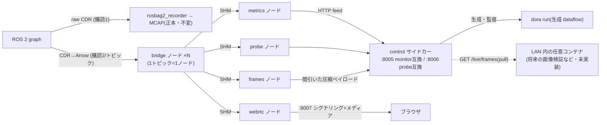

# dora_live — dora ブリッジによるライブ DDS インジェストとファンアウト

> ステータス: 実装済み(compose profile `live` によるオプトイン)。既定スタックでは起動しない。
> 検証: ~/ros2_to_dora ベンチ(28セル)+ 追加3セル(Cyclone interop / rm_ros_interfaces 実ブリッジ /
> 有線 LAN エミュレーション)+ 実データ E2E(bag ループ再生グラフ、メディア受信まで)。

## 目的と位置づけ

ライブ系消費者(メトリクス・プローブ・リアルタイム解析・WebRTC プレビュー)の DDS 購読を
**1 トピック 1 購読**に集約し、dora の共有メモリファンアウトで配る。録画系(rosbag2_recorder)は
**独立購読のまま不変** — dora_live が全停止しても正本 MCAP 経路は無傷(安全は topology が担う)。

**配置はロボット側**(split では `compose.robot.yaml`。裁定 2026-07-22 — 旧 recording 側配置を
置換)。旧 trio(monitor/streamer/probe)と同じトポロジーで、ライブトピックが DDS として
ワイヤを渡ることは決してなく、ロボットを出るのは軽量な派生データのみ(メトリクス JSON :8005/:8006、
エンコード済み WebRTC :8007)。役割分担は次で固定する:

- **dora_live(ロボット側)** = 非破壊・軽量・ストリーミング処理。持てるのは監視と
  「録画終了〜次の録画開始の窓で清算できる」結果まで。窓の間もオペレータは teleop で
  シーンをリセットしている(ロボットはアイドルではない)ため、予算はバースト込みで保守的に切る。
- **dora_runner(録画 PC 側)** = 重い解析・変換のすべて。rsync 後の MCAP を読む後処理で、
  タイミングに関係なくバーストが重い処理はこちらに置く。



## dora のピン方針(重要)

- リリース版 dora(0.5.0〜1.0.0-rc.3)は **DDS domain 0 固定**のため実機(ROS_DOMAIN_ID 可変)に
  接続できない。**upstream main のコミット固定ソースビルド**(`DORA_COMMIT`、既定 `de261f77…`)を
  使用し、`Ros2Context(domain_id)` 引数 > `ROS_DOMAIN_ID` env > 0 の優先順で任意ドメインに接続する。
- CLI と Python wheel は**同一コミットから**ビルド(混在不可)。
- **撤退線**: domain_id 対応入りの正式リリースが出たら PyPI wheel へ戻す(dora-rs/dora#1626)。

## HTTP 契約(すべて既存契約の互換面 — フロントエンド無改修)

| ポート | 互換対象 | 切替レバー |
|---|---|---|
| `DORA_LIVE_PORT`(8005) | topic_monitor 全ルート(/topics /metrics(+SSE) /metrics/pause·resume /alerts(+SSE) /incidents /readyz) | orchestrator の `TOPIC_MONITOR_PORT` |
| `DORA_LIVE_PROBE_PORT`(8006) | topic_probe 全ルート(/topics /fields /sample /stream /readyz) | nginx の probe プロキシ env |
| `DORA_LIVE_WEBRTC_PORT`(8007) | webrtc_streamer の 4 ルート(/stream/start·stop·status·offer) | nginx の `WEBRTC_HOST`/`WEBRTC_PORT` |

追加(dora_live 固有): `GET /live/status`(manifest・pending・dataflow 生死・正直マーカー)、
`POST /live/reload`(manifest 再導出)、`GET /live/events`(解析イベントリング — 拡張シーム、
下記)、`GET /live/frames`+`GET /live/frame?topic=`(ライブフレームレーン、下記)、
`POST /internal/*`(dataflow ノード → control のフィード面。外部契約ではない)。

## LIVE_CONFIG — ライブトピック集合・QoS・video レーン(`config/<robot>/live/default.yaml`)

録画トピック(RECORDING_CONFIG)とライブトピックを**分離**する設定面。全フィールドが省略可能で
ロボット非依存の既定を持つため、**新ロボットは live config なしで動く**(小工数適用の要)。
`make` が ROBOT から `LIVE_CONFIG` を導出(他アスペクトと同じ流儀)。スキーマ注釈付きテンプレは
[`config/template/live/default.yaml`](../../../config/template/live/default.yaml)。

| キー | 既定 | 意味 |
|---|---|---|
| `topics` | `null` | `null` = recording の `default_topics` を継承。明示リストは完全置換 |
| `extra_topics` | `[]` | ライブ専用の追加(監視するが録画しない等) |
| `exclude` | `[]` | glob で最終集合から除外(録画は継続・ブリッジには入れない等) |
| `qos_overrides` | `[]` | per-topic 購読 QoS(先勝ち)。フォールバックは recording の `topic_qos_overrides` → **publisher 実 QoS の自動マッチ**(monitor と同一の `resolve_subscription_qos` を再利用 — QoS 判断の二重実装はない) |
| `video` | `[]` | video レーン規則(先勝ち)。`codec: image\|ffmpeg\|raw\|off` |
| `frames` | `{enabled: true, sample_hz: 2.0}` | ライブフレームレーン(下記)の有効化と per-topic 間引きレート |
| `queue_size` | `1000` | 生成 dataflow の全エッジに付く queue_size |

- QoS 自動マッチの素材は rclpy graph ポーラが `get_publishers_info_by_topic` で収集した
  publisher の**実 offered QoS**(reliability/durability/depth)。解決結果は bridge の購読
  (`BRIDGE_QOS`/`BRIDGE_QOS_DURABILITY`/`BRIDGE_QOS_DEPTH`)と `/live/status` の `qos` に反映。
  durability は pinned dora API が拒否した場合 volatile へ縮退(ログに明示・死なない)。
- ライブメトリクス(Monitor タブの Hz/帯域)が出るのは**ライブ集合のみ**。exclude した録画
  トピックは録画され続けるが、ライブ Hz は出ない(discovery の全トピック一覧には出る)。

### video レーン(WebRTC プレビュー)と ffmpeg 対応

規則にマッチしないトピックは **msg 型で自動解決**(ここもロボット非依存):

| 型 | codec | デコード |
|---|---|---|
| `sensor_msgs/CompressedImage` | `image` | JPEG/PNG → cv2.imdecode(従来通り) |
| `ffmpeg_image_transport(_msgs)/FFMPEGPacket` | `ffmpeg` | H.264/HEVC/… → PyAV(av)でステートフルにデコード。keyframe 待ち合わせ+視聴解除ギャップ後の自動リセット(GOP 途中参加のスミア防止)。encoding 名(`libx264`/`h264_nvenc`/`hevc_*` 等)からデコーダを解決 |
| `sensor_msgs/Image`(生) | 既定で対象外 | `codec: raw` の明示規則でのみ opt-in(bgr8/rgb8/mono8)。既定除外の根拠 = 55MB/s 超の生カメラは RustDDS 断片化ロスのレジームに入る(ベンチ実測) |

- topic→codec の対応は生成器が `DORA_LIVE_VIDEO_MAP`(JSON)として webrtc ノードに渡し、
  `/live/status` の `video` にも出る。デコードは視聴中トピックのみ(wants() ゲート)。
  ffmpeg codec は attach 直後に最大 1 GOP 分の初回遅延がある(keyframe 待ち)。
- `FFMPEGPacket` の `.msg` は dora_live イメージに同梱
  (`ros-<distro>-ffmpeg-image-transport-msgs`)— per-robot overlay 不要。デコード自体は
  PyAV wheel(ffmpeg 同梱)で行い、apt の ffmpeg には依存しない。

## ライブフレームレーンと拡張シーム(裁定 2026-07-22)

将来のオフロボット画像解析(ライブ画像判定)に向けた**ロボット側の半分だけ**を実装済み。
消費側(画像 validator 等)は未実装で、以下がそれが接続する安定契約:

- **frames ノード**: video レーンのトピックのうち `image`(JPEG/PNG そのまま)と
  `ffmpeg`(**keyframe のみ** — デルタ AU は間引き転送では復号不能)を `sample_hz`
  (既定 2.0)で間引き、control へ集約。**raw は対象外**(転送には再エンコードが必要 =
  ロボット予算違反)。ロボット上ではデコードも再エンコードも一切しない。
- **pull 契約**(:8005): `GET /live/frames` = per-topic メタデータ索引(topic/codec/encoding/
  size/stamp_ns/recv_t/seq)、`GET /live/frame?topic=` = 最新ペイロード(1 スロット=
  latest-wins。ETag=seq、`If-None-Match` で 304)。**push でなく pull** を選んだ理由:
  ロボットが消費側のアドレスを知る必要がなく(env 依存が増えない)、消費側停止のコストが
  ロボットにゼロで、取り込みペースを消費側が自律制御できる。誰も pull しなければ
  ワイヤコストもゼロ。
- **解析イベントリング**(拡張シーム): 任意の lane ノードが `POST /internal/analysis/events`
  へイベントを push し、消費側は `GET /live/events` を poll。組込みデモ判定器(旧 ai ノード)は
  **裁定により削除** — 残るのはこの汎用 intake のみ。
- **将来の消費側の設計指針(未実装・TBD)**: 画像 validator は録画 PC 側
  (dora_runner の streaming 取り込み口 or 別コンテナ)に置き、結果は `report/live_image/` に
  名前空間分離・verdict に `coverage: sampled` を焼いてバッチ検証(全数)を上書きしない。
  run への紐付けは orchestrator の録画状態との時刻窓照合、録画間は ambient なライブ状態として扱う。

## 統計エンジンの共有

メトリクス演算・アラート・ベースライン学習は `kairos_common.monitoring`(topic_monitor から抽出)を
**無改造で再利用**。dora_live は `TopicSubscriber` Protocol の別実装(`DoraFeedSubscriber` =
HTTP フィード + rclpy graph ポーラ)を注入するだけ。判定ロジックの二重実装はない。

## dataflow 生成の規律

- **全ノード間入力に `queue_size`(既定 1000)必須** — 生成器が欠落を拒否し、ユニットテストが lint
  する(dora 既定キューは高頻度小メッセージを落とす: ベンチ §4.3 で実証・反証済み)。
- ノードは `run_node.sh` ラッパー経由で起動(dora は `*.py` を system python で実行し venv を
  無視するため。ベンチ実証のバイパス)。
- webrtc ノードの入力は **manifest 上で video codec が解決したトピックのみ**(LIVE_CONFIG の
  規則+型既定。生 Image は `codec: raw` の明示 opt-in がない限り対象外)。
- manifest の実効変化(トピック集合・解決 QoS・video レーン)は dataflow 再起動でのみ適用
  (グラフは run ごとに静的)。再導出は pending リトライと `POST /live/reload` の契機のみで、
  publisher の出入りでフラップしない。

## セルフチェックと正直性

- discovery 整定 15 秒(クロス RMW の SPDP マッチングは 6〜8 秒: Cell A)。
- **ドメイン誤り = 「allowlist 0/N 可視」として顕在化**し、pending 非空 + readyz 503。健康を装わない。
- 型解決は AMENT_PREFIX_PATH の `.msg` のみ・遅延評価。失敗はイベント値の RuntimeError として
  届く(Cell B)ため、bridge がガードして **unbridged トピックも Hz は計測継続**(size/stamp は不可)。
- `metrics_source: dora_bridge`(Hz はワイヤでなくブリッジ通過後)・`dds_samples_lost_available:
  false`(RMW イベント非対応、損失検出は expected_hz shortfall の床が担う)を API で明示。
- クラッシュループガード: 120 秒に 3 回の `dora run` 異常終了で degraded(readyz 503)。

## カスタム型(realman 等)

`make msgs-build` で事前ビルドした overlay を `/opt/msgs_overlay` にマウント(recorder/monitor/probe と
同一契約)。entrypoint が setup.bash を source して AMENT_PREFIX_PATH を伸ばし、ブリッジが `.msg` を
直接パースする(Cell B: フィールド値 660/660 一致を実測)。

## 起動と切替

```bash
# 単一ホスト — 推奨: make のノブ1つ(ROBOT と同じ _prefer_env 流儀。.env に LIVE=1 で恒久化)
make up LIVE=1   # dora_live 起動 + 旧 monitor/probe/streamer 停止 + 向き先切替
make up          # 旧構成へ戻す(dora_live は停止)

# split — dora_live はロボット側。.env.split に LIVE=1 を書くと両ホストで sticky
make robot-up LIVE=1       # [ロボット] recorder + dora_live(trio 停止)
make recording-up LIVE=1   # [録画PC] orchestrator/dora/frontend(向き先 = ロボットの 8005/8006/8007)
make robot-up LIVE=0       # [ロボット] legacy trio へ戻す(dora_live 停止)

# 手動(お試し・旧サービス並走。詳細と注意は .env.example の切替ブロック参照):
docker compose --profile live up -d dora_live
TOPIC_MONITOR_PORT=8005 docker compose up -d orchestrator
WEBRTC_PORT=8007 TOPIC_PROBE_PORT=8006 docker compose up -d frontend
```

LIVE=1 が旧3サービスを**停止**するのは、`TOPIC_PROBE_PORT` 等が旧サービスの bind ポートと
プロキシ向き先を兼ねており、並走させたまま値を切り替えると再作成時にポート衝突するため。

注意: `make` を介さず素の `docker compose` で起動する場合、`.env` の stale な相対
`RECORDING_CONFIG` に注意(`RECORDING_CONFIG=/config/<robot>/recording/default.yaml` を明示)。

## 既知の制約(TBD — 独立監査 2026-07-22 の残条件を含む)

- **実 2 台検証は未了**(単一ホスト split リハーサル+netem エミュレーションまで)。ロボット側
  配置によりライブトピックの DDS がワイヤを渡る懸念は消えた(残るワイヤ経路は HTTP プロキシ
  /WebRTC メディア/importer・rsync のみ)。残: 実 2 台での HTTP/メディア経路と rsync、実機
  domain + 実 msgs overlay での再走。
- **ffmpeg codec(FFMPEGPacket)と raw opt-in は実カメラ未検証**(ユニットテストは PyAV
  ラウンドトリップまで)。realman/aloha 等の実トピックでの初回検証が必要。
- **stamp_delay_ms は wall-clock 真値**(ingest で epoch→monotonic 変換済み)。bag リプレイ中は
  「録画時刻からの経過」= 数百日級の値が出るのが正しい挙動(実機ではミリ秒オーダー)。リプレイ中に
  stamp_delay 系のアラート閾値を掛けると常時発火する点に注意。
- ライブ Monitor は縮退版: `dds_samples_lost` は常に 0(RustDDS は RMW イベント非提供)、
  `loss_rate`/baseline 由来の一部指標は null になり得る。損失検出は expected_hz shortfall の床。
- ライブプラグイン契約の**ロボット側**は上記フレームレーン+イベントリングとして確定。
  **消費側**(録画 PC の画像 validator・dora_runner の streaming 取り込み口)は未実装・未設計。
- SSE の `/metrics/stream` は monitor と同じ全量スナップショット方式(diff ではない)。
- make の env 解決は `.env` 優先(`_prefer_env`)で、split 固有値は `.env.split` — LIVE のみ
  `.env.split` フォールバックを実装済み。他キーの二重定義には注意。
