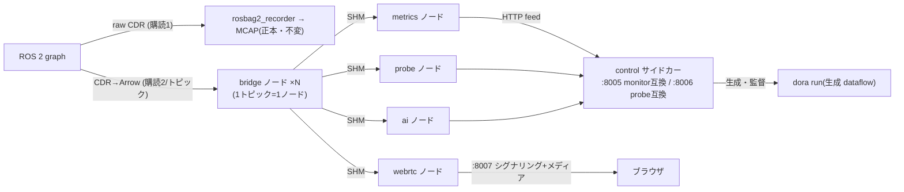

# dora_live — dora ブリッジによるライブ DDS インジェストとファンアウト

> ステータス: 実装済み(compose profile `live` によるオプトイン)。既定スタックでは起動しない。
> 検証: ~/ros2_to_dora ベンチ(28セル)+ 追加3セル(Cyclone interop / rm_ros_interfaces 実ブリッジ /
> 有線 LAN エミュレーション)+ 実データ E2E(bag ループ再生グラフ、メディア受信まで)。

## 目的と位置づけ

ライブ系消費者(メトリクス・プローブ・リアルタイム解析・WebRTC プレビュー)の DDS 購読を
**1 トピック 1 購読**に集約し、dora の共有メモリファンアウトで配る。録画系(rosbag2_recorder)は
**独立購読のまま不変** — dora_live が全停止しても正本 MCAP 経路は無傷(安全は topology が担う)。



## dora のピン方針(重要)

- リリース版 dora(0.5.0〜1.0.0-rc.3)は **DDS domain 0 固定**のため実機(ROS_DOMAIN_ID 可変)に
  接続できない。**upstream main のコミット固定ソースビルド**(`DORA_COMMIT`、既定 `de261f77…`)を
  使用し、`Ros2Context(domain_id)` 引数 > `ROS_DOMAIN_ID` env > 0 の優先順で任意ドメインに接続する。
- CLI と Python wheel は**同一コミットから**ビルド(混在不可)。
- **撤退線**: domain_id 対応入りの正式リリースが出たら PyPI wheel へ戻す(dora-rs/dora#1626)。

## HTTP 契約(すべて既存契約の互換面 — フロントエンド無改修)

| ポート | 互換対象 | 切替レバー |
|---|---|---|
| `DORA_LIVE_PORT`(8005) | topic_monitor 全ルート(/topics /metrics(+SSE) /metrics/pause·resume /alerts(+SSE) /incidents /readyz) | orchestrator の `TOPIC_MONITOR_PORT` |
| `DORA_LIVE_PROBE_PORT`(8006) | topic_probe 全ルート(/topics /fields /sample /stream /readyz) | nginx の probe プロキシ env |
| `DORA_LIVE_WEBRTC_PORT`(8007) | webrtc_streamer の 4 ルート(/stream/start·stop·status·offer) | nginx の `WEBRTC_HOST`/`WEBRTC_PORT` |

追加(dora_live 固有): `GET /live/status`(manifest・pending・dataflow 生死・正直マーカー)、
`POST /live/reload`(manifest 再導出)、`GET /live/events`(リアルタイム解析イベント)、
`POST /internal/*`(dataflow ノード → control のフィード面。外部契約ではない)。

## 統計エンジンの共有

メトリクス演算・アラート・ベースライン学習は `kairos_common.monitoring`(topic_monitor から抽出)を
**無改造で再利用**。dora_live は `TopicSubscriber` Protocol の別実装(`DoraFeedSubscriber` =
HTTP フィード + rclpy graph ポーラ)を注入するだけ。判定ロジックの二重実装はない。

## dataflow 生成の規律

- **全ノード間入力に `queue_size`(既定 1000)必須** — 生成器が欠落を拒否し、ユニットテストが lint
  する(dora 既定キューは高頻度小メッセージを落とす: ベンチ §4.3 で実証・反証済み)。
- ノードは `run_node.sh` ラッパー経由で起動(dora は `*.py` を system python で実行し venv を
  無視するため。ベンチ実証のバイパス)。
- webrtc ノードの入力は **CompressedImage 型トピックのみ**(realman の生 Image は対象外 —
  55MB/s 超で RustDDS 断片化ロスのレジームに入るため。裁定 2026-07-22)。

## セルフチェックと正直性

- discovery 整定 15 秒(クロス RMW の SPDP マッチングは 6〜8 秒: Cell A)。
- **ドメイン誤り = 「allowlist 0/N 可視」として顕在化**し、pending 非空 + readyz 503。健康を装わない。
- 型解決は AMENT_PREFIX_PATH の `.msg` のみ・遅延評価。失敗はイベント値の RuntimeError として
  届く(Cell B)ため、bridge がガードして **unbridged トピックも Hz は計測継続**(size/stamp は不可)。
- `metrics_source: dora_bridge`(Hz はワイヤでなくブリッジ通過後)・`dds_samples_lost_available:
  false`(RMW イベント非対応、損失検出は expected_hz shortfall の床が担う)を API で明示。
- リアルタイム解析は**デモ判定器**(`grade: "demo"` を全イベントに付与): joint 速度 z-score
  (5s クールダウン)+ stamp 遅延(1 時間超はクロックドメイン相違として info 分類)。
- クラッシュループガード: 120 秒に 3 回の `dora run` 異常終了で degraded(readyz 503)。

## カスタム型(realman 等)

`make msgs-build` で事前ビルドした overlay を `/opt/msgs_overlay` にマウント(recorder/monitor/probe と
同一契約)。entrypoint が setup.bash を source して AMENT_PREFIX_PATH を伸ばし、ブリッジが `.msg` を
直接パースする(Cell B: フィールド値 660/660 一致を実測)。

## 起動と切替

```bash
# 推奨: make のノブ1つ(ROBOT と同じ _prefer_env 流儀。.env に LIVE=1 で恒久化)
make up LIVE=1   # dora_live 起動 + 旧 monitor/probe/streamer 停止 + 向き先切替
make up          # 旧構成へ戻す(dora_live は停止)

# 手動(お試し・旧サービス並走。詳細と注意は .env.example の切替ブロック参照):
docker compose --profile live up -d dora_live
TOPIC_MONITOR_PORT=8005 docker compose up -d orchestrator
WEBRTC_PORT=8007 TOPIC_PROBE_PORT=8006 docker compose up -d frontend
```

LIVE=1 が旧3サービスを**停止**するのは、`TOPIC_PROBE_PORT` 等が旧サービスの bind ポートと
プロキシ向き先を兼ねており、並走させたまま値を切り替えると再作成時にポート衝突するため。

注意: `make` を介さず素の `docker compose` で起動する場合、`.env` の stale な相対
`RECORDING_CONFIG` に注意(`RECORDING_CONFIG=/config/<robot>/recording/default.yaml` を明示)。

## 既知の制約(TBD)

- 実 NIC・実 2 台構成での有線越え検証は未了(Cell C は veth+netem エミュレーション)。
- ライブプラグイン契約(dora_runner の kairos_plugin.yaml のライブ拡張)は未設計 — 現状の解析
  レーンは組込みデモ判定器のみ。
- SSE の `/metrics/stream` は monitor と同じ全量スナップショット方式(diff ではない)。
