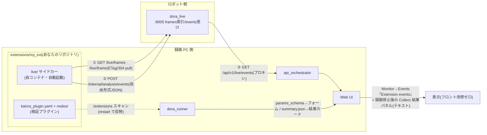

# extensions/ — ユーザー拡張の置き場(非破壊・drop-in・自動取り込み)

kairos 本体のコードを**一切変更せずに**、自作の処理を 2 つの側面に組み込むための
ディレクトリです。`extensions/` 直下は(この README と `_template/`・`_examples/`
を除き)**gitignore 済み**なので、自分のリポジトリをそのまま置けます:

```bash
git clone https://github.com/you/my-ext extensions/my_ext
```

`git submodule add` を使う場合は 2 点注意(gitignore 対象パスのため):
`-f` が必要で、`.gitmodules` + gitlink が **kairos 側のコミット履歴に入ります**
(自分の fork なら問題なし。kairos の履歴を汚したくなければ plain clone を推奨)。

はじめ方はどちらでも:
- `cp -r extensions/_template extensions/my_ext` — 両レーン入りの**テンプレ**
- `cp -r extensions/_examples/grayscale extensions/grayscale` — そのまま動く**実例**

`_` で始まるフォルダ(`_template`/`_examples`)はテンプレ扱いで、
どちらのレーンにも**ロードされません**(コピーして使う)。

## 拡張を入れた時の全体像



ポイント: ①〜③のどこにも kairos 本体の改修は無い。ライブ側の判定結果は
イベントとして UI に流れ、録画停止時にはその録画窓に重なったイベントが
**Collect の結果パネルにテキスト表示**される(取得後レビューの動線)。

## 2 つの組み込み面 — どちらも「置くだけ」

| 面 | 実行場所 | 反映方法 |
|---|---|---|
| ① ライブ(dora_live 側) | **自分のコンテナ**(`live/compose.yaml`・別プロジェクト `kairos-ext-<name>`) | **自動**: `make up`(LIVE=1)/ `make recording-up` が起動、`make down` が撤去、コード編集の反映は `make ext-reload`(compose.yaml 自体の変更は `make ext-live EXT=` / `recording-up` で再作成)、状態は `make ps`。除外したい拡張は compose の**行頭**に `x-kairos-autostart: false` を 1 行 |
| ② 録画後検証(dora_runner 側) | dora_runner コンテナ内(マウントされた `/extensions`) | **自動**: `make restart dora_runner` でスキャン(既存スタックでの初回だけ `make rebuild dora_runner`) |

手動の逃げ道(①): `make ext-live EXT=<name>` / `make ext-live-down EXT=<name>` —
LAN 内の任意ホストで個別起動したい時用。**`make robot-up` は拡張を絶対に起動しません**
(ロボット予算裁定)。ロボット上でどうしても動かすなら手動 ext-live の明示操作のみ。

split 構成では **`make recording-up` が録画 PC 側で拡張を起動し、ロボットの
`:8005` へ自動接続**します(.env.split の TOPIC_MONITOR_HOST から導出 —
robot IP の手打ちは不要)。

## ① ライブ拡張が「入力」に使えるもの(現状の全カタログ)

すべて dora_live の HTTP 面(既定 `http://<robot>:8005`、probe は `:8006`)。
pull 型なので好きな周期で読めます:

| エンドポイント | 得られるもの | 備考 |
|---|---|---|
| `GET /live/frames` → `GET /live/frame?topic=` | **間引き済み圧縮カメラフレーム**(topic/codec/encoding/size/stamp_ns/recv_t/seq、ETag/304) | `codec: image` = JPEG/PNG そのまま(cv2 で復号可)。`ffmpeg` = H.264/HEVC **keyframe のみ**(復号には PyAV)。間引きは `frames.sample_hz`(既定 2Hz)。**raw 画素・全フレームは来ない**(それは録画後②の仕事) |
| `GET /metrics`(SSE: `/metrics/stream`) | 全トピックの **Hz/帯域/ギャップ/ステータス**スナップショット | topic_monitor 互換。数値は Rust 側計数の実測 |
| `GET /topics` | **グラフ discovery**(名前/型/publisher・subscriber 数) | ライブ集合の外のトピックも全部見える(実測 221 トピック) |
| `GET /alerts`(SSE: `/alerts/stream`)/ `GET /incidents?since_ns=` | 閾値アラートの現在状態と発火履歴 | しきい値は config の alert rules |
| `GET /live/events?since=` | **他の拡張が POST したイベント** | 拡張同士の合成が可能(t = epoch 秒でフィルタ) |
| `GET /live/status` | manifest・QoS 解決結果・dataflow 生死・discovery ソース | 自己診断/ヘルスゲート用 |
| `:8006 /topics /fields?topic= /sample?topic=&fields=` | **任意トピックの数値フィールド値**(オンデマンド) | probe 互換面。視聴中だけペイロードが具現化される(tap) |

## ① ライブ拡張の「UI への出力」(フロント改造コスト 0)

`POST http://<robot>:8005/internal/analysis/events` に**自由形式 JSON** を送るだけで、
Web UI の **Monitor → Events → 「Extension events」** に汎用描画されます:

- `kind` / `source` / `topic` / `t`(epoch 秒・省略時サーバが付与)は専用スロット表示
- **それ以外のキーは全て `key=value` チップとして自動表示** — 新しいイベント形を
  作ってもフロントエンドの変更は不要(検証レーンの params_schema/SummaryResult と
  同じ UI 非依存契約)
- リング保持(直近 500 件・非永続)。UI は 2 秒ポーリング・新しい順表示
- LIVE=0(旧 monitor)ではこの面自体が無いため、UI のカードは表示されません

検証レーン(②)の UI 出力は従来どおり: マニフェストの `params_schema` が
フォームに、`summary.json`(`result: pass|fail` + metrics)が結果カードになります。

## 診断

- ①が動かない: `make ps`(kairos-ext-* の状態)→ `make ext-live EXT=<name>` で
  フルエラー表示。イベントが UI に出ない: `curl -s localhost:8005/live/events`。
- ②が出てこない: `GET :8020/pipelines` の `plugin_errors` と
  `make logs dora_runner` の `plugin load failed`。

## セキュリティ(正直な前提)

拡張は**任意のコード**です — ①は自分のコンテナ(compose 定義もあなたのもの)、
②は dora_runner プロセス内で実行され(/data 書き込み可)、`entrypoint.callable`
型は**起動時 discovery の時点で import = 実行**されます。フォルダを置いた時点で
次の `make up` から自動起動します(それが取り込み同意です)。**信頼できるコード
だけを置いてください**。

## 制約(正直な注意書き)

- `dora run` はデータフロー YAML の**隣に書き込む**ため、テンプレの compose は
  拡張フォルダを writable な場所へコピーしてから起動します。
- テンプレには CPU 1.0 / メモリ 1GB / ログ 10MB×3 の上限を同梱(録画と競合させない
  既定。必要なら意図的に引き上げる)。
- dora CLI の無いホストでは②は in-process インタプリタ実行(`process(inputs, ctx)`
  が必須な理由)。
- **`git clean -fdx` はここに置いた未 push の拡張ごと消します**。

## 内容物

```
_template/            # 両レーン入りテンプレ(輝度watcher + topic_census)
_examples/grayscale/  # そのまま動く実例(frames → グレースケール → UIイベント)
```
