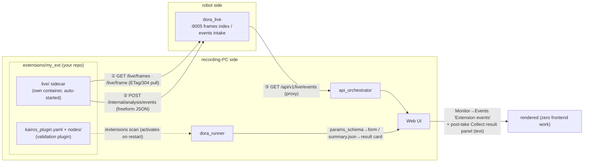

# extensions/ — user extension drop-ins (non-destructive, auto-ingested)

This directory plugs your own processing into two seams **without touching
kairos code**. Everything directly under `extensions/` (except this README,
`_template/`, and `_examples/`) is **gitignored**, so you can place your own
repo here:

```bash
git clone https://github.com/you/my-ext extensions/my_ext
```

If you want `git submodule add`, two caveats (the path is gitignored): it needs
`-f`, and it records `.gitmodules` + a gitlink **in your kairos checkout's
history** (fine on your own fork; prefer a plain clone otherwise).

Start from either:
- `cp -r extensions/_template extensions/my_ext` — the **template** with both lanes
- `cp -r extensions/_examples/grayscale extensions/grayscale` — a **working example**

Folders starting with `_` (`_template`/`_examples`) are scaffolding and are
**never loaded by either lane** (copy them out to use them).

## The whole picture with an extension installed



Key point: none of ①–③ touches kairos itself. Live-side verdicts flow to the
UI as events, and at recording stop the events that overlapped the take are
**shown as text on the Collect result panel** (the post-take review path).

## The two seams — both are "just drop it in"

| Seam | Runs where | Activation |
|---|---|---|
| ① Live (dora_live side) | **your own container** (`live/compose.yaml`, own project `kairos-ext-<name>`) | **Automatic**: `make up` (LIVE=1) / `make recording-up` starts it, `make down` removes it, code edits apply via `make ext-reload` (changes to compose.yaml itself need a re-create: `make ext-live EXT=` / `recording-up`), state shows in `make ps`. Opt out per extension with one **top-level** `x-kairos-autostart: false` line |
| ② Post-recording validation (dora_runner side) | inside dora_runner (mounted `/extensions`) | **Automatic**: scanned on `make restart dora_runner` (one-time `make rebuild dora_runner` on an existing stack's first use) |

Manual escape hatches (①): `make ext-live EXT=<name>` / `make ext-live-down
EXT=<name>` — for starting on an arbitrary LAN host. **`make robot-up` never
starts extensions** (robot-budget ruling); running one ON the robot is a
deliberate manual ext-live only.

In the split deployment **`make recording-up` starts extensions on the
recording PC and auto-targets the robot's `:8005`** (derived from
TOPIC_MONITOR_HOST in .env.split — no hand-typed robot IP).

## ① What a live extension can consume today (the full input catalog)

All on dora_live's HTTP surface (default `http://<robot>:8005`; probe on
`:8006`). Everything is pull-based — read at your own pace:

| Endpoint | What you get | Notes |
|---|---|---|
| `GET /live/frames` → `GET /live/frame?topic=` | **decimated compressed camera frames** (topic/codec/encoding/size/stamp_ns/recv_t/seq, ETag/304) | `codec: image` = JPEG/PNG passthrough (cv2-decodable). `ffmpeg` = H.264/HEVC **keyframes only** (needs PyAV). Decimation = `frames.sample_hz` (default 2 Hz). **No raw pixels, no full frame rate** (that is lane ②'s job, post-recording) |
| `GET /metrics` (SSE: `/metrics/stream`) | per-topic **Hz/bandwidth/gap/status** snapshot | topic_monitor-compatible; Rust-side counting |
| `GET /topics` | **graph discovery** (name/type/publisher/subscriber counts) | sees the whole graph beyond the live set (221 topics measured) |
| `GET /alerts` (SSE: `/alerts/stream`) / `GET /incidents?since_ns=` | threshold-alert state + fired history | thresholds from the config's alert rules |
| `GET /live/events?since=` | **events other extensions posted** | extensions can compose (filter on `t` = epoch seconds) |
| `GET /live/status` | manifest, resolved QoS, dataflow liveness, discovery source | for self-diagnosis / health gating |
| `:8006 /topics /fields?topic= /sample?topic=&fields=` | **numeric field values of any topic** (on demand) | probe-compatible surface; payloads materialize only while watched (tap) |

## ① Passing output to the UI (zero frontend cost)

POST **freeform JSON** to `http://<robot>:8005/internal/analysis/events` and it
renders in the Web UI at **Monitor → Events → "Extension events"**:

- `kind` / `source` / `topic` / `t` (epoch seconds; server-stamped when absent)
  get dedicated slots
- **every other key renders automatically as a `key=value` chip** — new event
  shapes never require frontend changes (the live twin of the validation
  lane's params_schema/SummaryResult contract)
- ring-buffered (last 500, not persisted); the UI polls every 2 s, newest first
- under LIVE=0 (legacy monitor) the surface doesn't exist and the UI card stays
  hidden

Lane ②'s UI output is unchanged: the manifest's `params_schema` renders the
form, `summary.json` (`result: pass|fail` + metrics) renders the result card.

## Diagnostics

- ① not running: `make ps` (kairos-ext-* status) → `make ext-live EXT=<name>`
  for the full error. Events missing from the UI: `curl -s localhost:8005/live/events`.
- ② not listed: `plugin_errors` in `GET :8020/pipelines` and
  `make logs dora_runner` for `plugin load failed`.

## Security (honest premise)

Extensions are **arbitrary code** — lane ① is your own container (the compose
definition is yours too); lane ② executes inside the dora_runner process
(/data-writable), and `entrypoint.callable` plugins run **at boot-time
discovery**. Placing a folder means it auto-starts from the next `make up` —
that placement IS the ingestion consent. **Only install code you trust.**

## Constraints (honest fine print)

- `dora run` writes **next to the dataflow YAML**; the template compose copies
  the extension to a writable location first.
- The template ships caps: CPU 1.0 / mem 1 GB / logs 10 MB×3 (never compete
  with the recorder by default; raise deliberately).
- Hosts without the dora CLI run lane ② through the in-process interpreter
  (hence the mandatory `process(inputs, ctx)`).
- **`git clean -fdx` deletes unpushed extensions placed here.**

## Contents

```
_template/            # both-lane template (brightness watcher + topic_census)
_examples/grayscale/  # working example (frames → grayscale → UI events)
```
